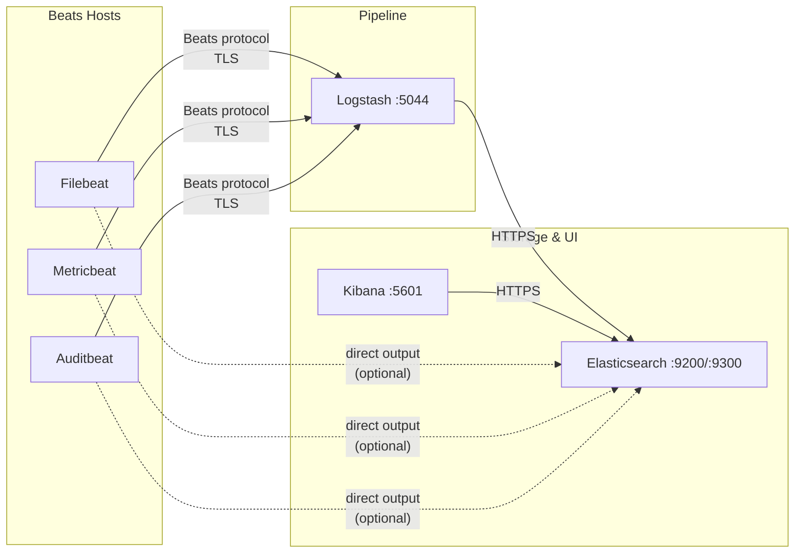
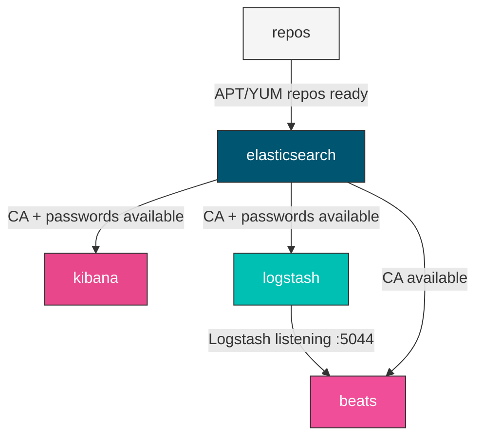
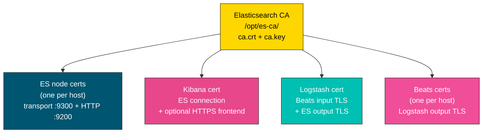
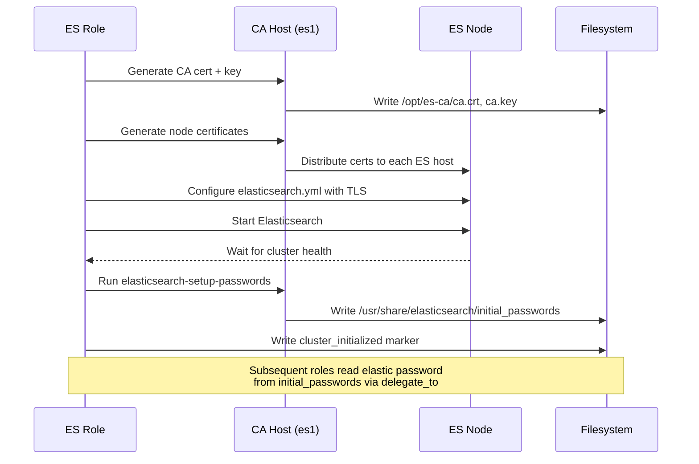
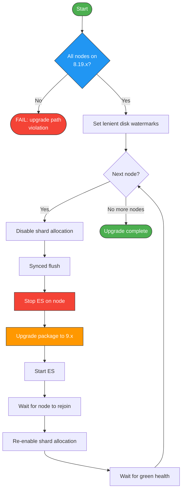

# Architecture

## Overview

The collection deploys four Elastic Stack services — Elasticsearch, Logstash, Kibana, and Beats — each managed by its own Ansible role. A fifth shared role (`elasticstack`) provides common defaults that all roles inherit. A sixth role (`repos`) manages Elastic APT/YUM package repositories.

When `elasticstack_full_stack: true` (the default), roles auto-discover hosts and connections through Ansible inventory groups. Each role looks up the other services' hosts using configurable group names (`elasticstack_elasticsearch_group_name`, `elasticstack_logstash_group_name`, etc.), so you don't need to hard-code addresses between services.

## Data flow



Beats collect logs, metrics, and audit data from hosts and forward them to Logstash over port 5044. Logstash processes and enriches events through its pipeline (input → filter → output) and writes them to Elasticsearch. Kibana reads from Elasticsearch to provide the web UI. All connections use TLS when security is enabled.

Beats can also output directly to Elasticsearch (bypassing Logstash) by setting `beats_filebeat_output: elasticsearch`.

## Role execution order

Roles should be applied in this order because each depends on the previous:



1. **repos** — Adds Elastic package repositories (APT/YUM). Must run first so packages are available.
2. **elasticsearch** — Installs ES, forms the cluster, initializes security (generates passwords, CA, certificates). Other roles need the CA and passwords.
3. **kibana** — Connects to Elasticsearch using the `kibana_system` password, gets its TLS certificate from the ES CA.
4. **logstash** — Creates its `logstash_writer` user and role in Elasticsearch, fetches TLS certificates from the ES CA, configures the pipeline.
5. **beats** — Installs Filebeat/Metricbeat/Auditbeat, fetches TLS certificates, configures output to Logstash or Elasticsearch.

In a full-stack playbook, all roles run on all relevant hosts. Each role internally checks `group_names` or uses `delegate_to` to only act on the correct hosts.

## TLS certificate chain

The collection manages a complete PKI rooted in a CA generated by the Elasticsearch certutil tool on the first ES host:



Certificate renewal is handled automatically: each role checks certificate expiry against a configurable buffer (default 30 days) and regenerates when needed. Tags like `renew_es_cert`, `renew_logstash_cert`, etc. allow targeted renewal runs.

### External certificates

All roles support `*_cert_source: external` to use certificates from any CA (corporate, ACME, Vault PKI). External certs can be provided as file paths or as inline PEM content in variables. The format (PEM vs PKCS12) is auto-detected for file paths; content mode is always PEM.

Elasticsearch supports separate transport and HTTP layer certificates — useful when transport uses an internal CA while HTTP uses a public ACME cert. HTTP falls back to transport if not specified.

See each role's documentation for the full variable reference.

## Security initialization

When Elasticsearch starts for the first time with security enabled:



The marker file (`cluster_initialized`) prevents re-initialization on subsequent runs. Other roles (Kibana, Logstash, Beats) delegate to the CA host to read the elastic password before making API calls.

## Rolling upgrades (8.x to 9.x)

The Elasticsearch role supports rolling upgrades when `elasticstack_version` is set to a 9.x version while 8.x is currently installed.

Before any upgrade work begins, the role validates the upgrade path: Elasticsearch 9.x requires that all nodes are already on 8.19.x. If any node is running an older 8.x version (e.g. 8.17.0), the play fails immediately with an `UPGRADE PATH VIOLATION` error directing you to upgrade to 8.19.x first. This matches [Elastic's official upgrade requirements](https://www.elastic.co/docs/deploy-manage/upgrade/deployment-or-cluster).

Once validated, the upgrade proceeds one node at a time:



The role sets lenient disk watermarks (97/98/99%) during the upgrade to prevent CI and small-disk environments from blocking shard allocation.

### Post-upgrade: LogsDB

Upgraded clusters have `logsdb.prior_logs_usage: true` set internally, which causes `cluster.logsdb.enabled` to default to `false`. Fresh 9.x installs get LogsDB enabled by default. If you want the same behaviour on an upgraded cluster, enable it manually after the upgrade completes:

```
PUT _cluster/settings
{ "persistent": { "cluster.logsdb.enabled": true } }

POST logs-*/_rollover
```

LogsDB uses synthetic `_source`, which reorders fields, deduplicates arrays, and sorts leaf arrays. Test your dashboards and detection rules before enabling it in production.

## Inventory group mapping

| Default group name | Used by | Override variable |
|----|----|----|
| `elasticsearch` | All roles that need ES hosts | `elasticstack_elasticsearch_group_name` |
| `logstash` | Beats (output target), Logstash | `elasticstack_logstash_group_name` |
| `kibana` | Kibana role | `elasticstack_kibana_group_name` |

When `elasticstack_full_stack: false`, roles use `beats_target_hosts`, `logstash_elasticsearch_hosts`, etc. instead of inventory group lookups. This is useful for single-service deployments where the Ansible inventory doesn't contain all stack components.

## Container and CI workarounds

Several tasks detect container environments (`virtualization_type` in `container`, `docker`, `lxc`) and apply workarounds that are irrelevant for bare-metal or VM deployments:

| Workaround | Roles | Why |
|------------|-------|-----|
| systemd `Type=exec` override | elasticsearch | ES 8.19+ uses `Type=notify` + sd_notify, which fails in containers where the notify socket isn't functional. Without the override, systemd waits 900s then kills ES. |
| Lenient disk watermarks (97/98/99%) | elasticsearch | Containers often have limited disk. Default watermarks (85/90/95%) prevent shard allocation in small environments. |
| Cache cleanup (`rm -rf /var/cache/*`) | elasticsearch, kibana, beats | Frees disk for ES to allocate replica shards of the `.security-7` index. |

These workarounds are safe to leave in place — they only fire when `ansible_facts.virtualization_type` matches container-like environments.

## Retry budgets

The collection uses extensive retry logic to handle timing windows during cluster formation, security initialization, and rolling upgrades. Here are the key retry budgets:

| Operation | Retries | Delay | Total | Role |
|-----------|---------|-------|-------|------|
| Package install | 3 | 10s | ~30s | all |
| Bootstrap API check | 5 | 10s | ~50s | elasticsearch |
| Elastic password API check | 20 | 10s | ~200s | elasticsearch |
| Cluster health (security init) | 20 | 10s | ~200s | elasticsearch |
| Wait for port (per node) | — | — | 600s | elasticsearch |
| Kibana readiness | — | — | 300s | kibana |
| Rolling upgrade: API responsiveness | 30 | 10s | ~300s | elasticsearch |
| Rolling upgrade: pre-upgrade health | 50 | 30s | ~25min | elasticsearch |
| Rolling upgrade: node rejoin | 200 | 3s | ~10min | elasticsearch |
| Rolling upgrade: shard allocation | 5-10 | 30s | ~150-300s | elasticsearch |

All `until:` conditions use `| default()` for safe attribute access during mixed-version clusters where API responses may differ.

## Version-specific behavior (8.x vs 9.x)

!!! note
    Templates switch based on `elasticstack_release | int >= 9`. No user action needed beyond setting `elasticstack_release` — the correct config is generated automatically.

The collection handles ES 8.x and 9.x with version-conditional templates and guards:

| Area | ES 8.x | ES 9.x |
|------|--------|--------|
| Filebeat input type | `type: log` | `type: filestream` (requires unique `id`) |
| Filebeat multiline | Root-level `multiline:` block | Nested under `parsers:` |
| Logstash SSL parameters | `ssl`, `keystore`, `ssl_verify_mode` | `ssl_enabled`, `ssl_keystore_path`, `ssl_client_authentication` |
| Logstash root execution | Allowed | Refused (CLI only; systemd service unaffected) |
| ES upgrade path validation | N/A | Requires 8.19.x as stepping stone |
| ES security requirement | Required (ES 8+) | Required |

## Password and secret defaults

!!! warning "Change all default passwords before deploying to production"
    All roles ship with placeholder passwords. Store real values in Ansible Vault or a secrets manager.

| Variable | Default | Role |
|----------|---------|------|
| `elasticstack_ca_pass` | `PleaseChangeMe` | elasticstack |
| `elasticsearch_bootstrap_pw` | `PleaseChangeMe` | elasticsearch |
| `elasticsearch_tls_key_passphrase` | `PleaseChangeMeIndividually` | elasticsearch |
| `kibana_tls_key_passphrase` | `PleaseChangeMe` | kibana |
| `logstash_tls_key_passphrase` | `LogstashChangeMe` | logstash |
| `logstash_user_password` | `password` | logstash |
| `beats_tls_key_passphrase` | `BeatsChangeMe` | beats |

The `elastic` superuser password is auto-generated during security initialization and stored in `/usr/share/elasticsearch/initial_passwords`.
