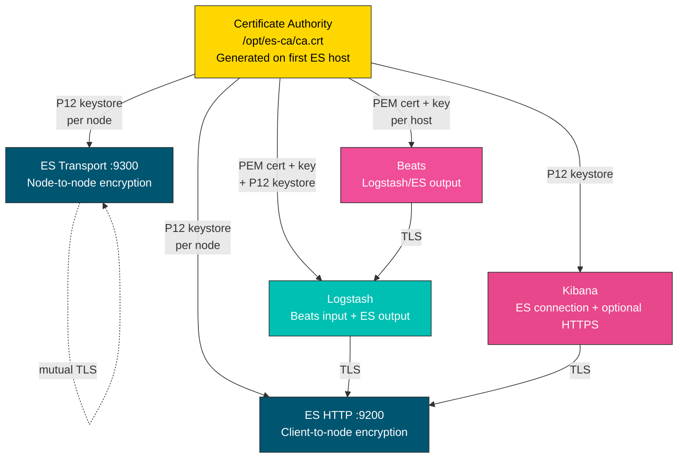

# TLS Configuration

This page explains how TLS works across the Elastic Stack collection — the trust chain, certificate formats, and complete configuration examples for the three certificate modes.

## Trust chain overview

When security is enabled (the default), every connection in the stack is encrypted with TLS. All certificates are rooted in a single CA generated by the Elasticsearch `certutil` tool on the first ES node:



Every service trusts the same CA, so they can verify each other's certificates without additional configuration. Certificate renewal is automatic — each role checks expiry on every run and regenerates certificates when they approach the buffer (default 30 days).

## Certificate formats

The collection uses different formats depending on what each service expects natively:

| Service | Format | Files |
|---------|--------|-------|
| Elasticsearch (transport) | PKCS12 | `<hostname>-transport.p12` |
| Elasticsearch (HTTP) | PKCS12 | `<hostname>-http.p12` |
| Kibana | PKCS12 | `<hostname>-kibana.p12` |
| Logstash (ES output) | PKCS12 | `keystore.pfx` |
| Logstash (Beats input) | PEM | `<hostname>-server.crt` + `<hostname>.key` |
| Beats | PEM | `<hostname>-beats.crt` + `<hostname>-beats.key` |

When using external certificates, both PEM (`.crt`, `.pem`) and PKCS12 (`.p12`, `.pfx`) are accepted. Format is auto-detected by probing the file content with `openssl`, not from the file extension.

## Mode 1: Auto-generated certificates (default)

This is the zero-configuration path. The collection generates a CA, creates certificates for every service, distributes them, and handles renewal automatically.

```yaml title="group_vars/all.yml"
elasticstack_release: 9
elasticstack_security: true   # default, shown for clarity

# One passphrase for all TLS keys across the stack:
elasticstack_cert_pass: "{{ vault_cert_pass }}"

# Or set per-service passphrases:
# elasticstack_ca_pass: "{{ vault_ca_pass }}"
# elasticsearch_tls_key_passphrase: "{{ vault_es_key_pass }}"
# kibana_tls_key_passphrase: "{{ vault_kibana_key_pass }}"
# logstash_tls_key_passphrase: "{{ vault_logstash_key_pass }}"
# beats_tls_key_passphrase: "{{ vault_beats_key_pass }}"

# Bootstrap password for initial elastic superuser setup
elasticsearch_bootstrap_pw: "{{ vault_bootstrap_pw }}"
```

!!! tip
    `elasticstack_cert_pass` is a shortcut that overrides all per-service key passphrases with a single value. Use it on day one to keep things simple. You can switch to per-service passphrases later without regenerating certificates.

That's it. No certificate paths, no CA configuration, no format choices. The playbook handles everything:

```yaml title="playbook.yml"
- hosts: all
  roles:
    - oddly.elasticstack.repos
    - oddly.elasticstack.elasticsearch
    - oddly.elasticstack.kibana
    - oddly.elasticstack.logstash
    - oddly.elasticstack.beats
```

### What happens under the hood

1. The Elasticsearch role generates a CA on the first ES host (`/opt/es-ca/`)
2. Each ES node gets transport and HTTP certificates signed by that CA
3. Kibana, Logstash, and Beats roles delegate to the CA host to generate their certificates
4. Certificates are distributed to each service host
5. Configuration files are written with the correct certificate paths
6. On subsequent runs, expiry is checked and certificates are renewed if needed

### Forcing renewal

```bash
# Renew all certificates
ansible-playbook -i inventory.yml playbook.yml --tags certificates

# Renew only Elasticsearch certificates
ansible-playbook -i inventory.yml playbook.yml --tags renew_es_cert

# Renew the CA (triggers renewal of all dependent certs)
ansible-playbook -i inventory.yml playbook.yml --tags renew_ca
```

## Mode 2: External certificates from files

Use certificates from your corporate CA, ACME (Let's Encrypt / Certbot), or any other PKI. Set `*_cert_source: external` on each role and provide paths to your certificate files.

```yaml title="group_vars/all.yml"
elasticstack_release: 9
elasticsearch_bootstrap_pw: "{{ vault_bootstrap_pw }}"

# --- Elasticsearch ---
elasticsearch_cert_source: external
elasticsearch_transport_tls_certificate: /etc/pki/elastic/es-transport.crt
elasticsearch_transport_tls_key: /etc/pki/elastic/es-transport.key
elasticsearch_http_tls_certificate: /etc/pki/elastic/es-http.crt
elasticsearch_http_tls_key: /etc/pki/elastic/es-http.key
elasticsearch_tls_ca_certificate: /etc/pki/elastic/ca.crt

# Certs are already on the managed nodes (e.g. from certbot or cloud-init)
elasticsearch_tls_remote_src: true

# --- Kibana ---
kibana_cert_source: external
kibana_tls: true
kibana_tls_certificate_file: /etc/pki/elastic/kibana.crt
kibana_tls_key_file: /etc/pki/elastic/kibana.key
kibana_tls_ca_file: /etc/pki/elastic/ca.crt
kibana_tls_remote_src: true

# --- Logstash ---
logstash_cert_source: external
logstash_tls_certificate_file: /etc/pki/elastic/logstash.crt
logstash_tls_key_file: /etc/pki/elastic/logstash.key
logstash_tls_ca_file: /etc/pki/elastic/ca.crt
logstash_tls_remote_src: true

# --- Beats ---
beats_cert_source: external
beats_security: true
beats_tls_certificate_file: /etc/pki/elastic/beats.crt
beats_tls_key_file: /etc/pki/elastic/beats.key
beats_tls_ca_file: /etc/pki/elastic/ca.crt
beats_tls_remote_src: true
```

### Per-host certificates

When each node has its own certificate (the norm for Elasticsearch transport), use `host_vars/`:

```yaml title="host_vars/es1.yml"
elasticsearch_transport_tls_certificate: /etc/pki/elastic/es1.crt
elasticsearch_transport_tls_key: /etc/pki/elastic/es1.key
```

```yaml title="host_vars/es2.yml"
elasticsearch_transport_tls_certificate: /etc/pki/elastic/es2.crt
elasticsearch_transport_tls_key: /etc/pki/elastic/es2.key
```

Or use a wildcard/SAN certificate in `group_vars/elasticsearch.yml` for all nodes.

### Simplifications and fallbacks

You don't always need to set every variable. The roles apply sensible defaults:

- **Key auto-derivation (PEM)**: If you only set the certificate path, the role looks for the key at the same path with `.key` extension. `/path/to/server.crt` derives `/path/to/server.key`.
- **HTTP falls back to transport (ES)**: If `elasticsearch_http_tls_certificate` is empty, the HTTP layer reuses the transport certificate.
- **CA auto-extraction**: If a PEM cert file contains a chain (common with ACME), everything after the first certificate is extracted as the CA. No need to set the CA variable separately.
- **P12 bundles**: For PKCS12 files, the key is bundled inside — no separate key variable needed.

### Controller-side vs remote-side files

By default (`*_tls_remote_src: false`), certificate files are on the Ansible controller and get copied to each managed node. Set `*_tls_remote_src: true` when files are already on the managed nodes — provisioned by certbot, cloud-init, Vault agent, or a configuration management tool.

### Logstash with certmonger / cert-manager (hands-off rotation)

For Logstash specifically, certificate copies can get out of sync with automatic renewals. When certmonger or cert-manager rotates the cert, the copy under `/etc/logstash/certs/` becomes stale until the next Ansible run.

Set `logstash_tls_copy_certs: false` to skip the copy. The pipeline config then references the original paths directly, and Logstash picks up the new cert on the next restart — which the renewal tool can trigger itself.

```yaml title="group_vars/all.yml"
logstash_cert_source: external
logstash_tls_copy_certs: false
logstash_tls_certificate_file: /etc/pki/logstash/server.crt
logstash_tls_key_file: /etc/pki/logstash/server.key
logstash_tls_ca_file: /etc/pki/logstash/ca.crt
```

Logstash runs as the `logstash` user and must be able to read the key. For certmonger, request the cert with the right ownership and restart hook:

```bash
getcert request \
  -f /etc/pki/logstash/server.crt -k /etc/pki/logstash/server.key \
  -o root:logstash -m 0640 \
  -O root:logstash -M 0644 \
  -C 'systemctl try-reload-or-restart logstash' \
  -c local -I logstash
```

The `-o root:logstash -m 0640` ensures Logstash can read the key; certmonger preserves this ownership across every renewal. The `-C` post-save hook replaces the Ansible re-run. Verified on Debian with certmonger 0.79 and tested on both certmonger and openssl-generated keys, which both produce PKCS#8 PEM directly.

!!! note
    This path does not generate `keystore.pfx`. If you need the Elasticsearch output's P12 keystore (`logstash_output_elasticsearch: true` with security), either leave `logstash_tls_copy_certs: true` or set `logstash_output_elasticsearch: false` and manage the ES output yourself.

## Mode 3: Inline PEM content from a secrets manager

When certificates come from HashiCorp Vault, AWS Secrets Manager, Azure Key Vault, or any system that provides certificate content rather than files, use the `*_content` variables. They take precedence over file paths.

```yaml title="group_vars/all.yml"
elasticstack_release: 9
elasticsearch_bootstrap_pw: "{{ vault_bootstrap_pw }}"

# --- Elasticsearch ---
elasticsearch_cert_source: external
elasticsearch_transport_tls_certificate_content: "{{ lookup('hashi_vault', 'secret/elastic/es-cert') }}"
elasticsearch_transport_tls_key_content: "{{ lookup('hashi_vault', 'secret/elastic/es-key') }}"
elasticsearch_tls_ca_certificate_content: "{{ lookup('hashi_vault', 'secret/elastic/ca-cert') }}"
# HTTP falls back to transport content automatically

# --- Kibana ---
kibana_cert_source: external
kibana_tls: true
kibana_tls_certificate_content: "{{ lookup('hashi_vault', 'secret/elastic/kibana-cert') }}"
kibana_tls_key_content: "{{ lookup('hashi_vault', 'secret/elastic/kibana-key') }}"
kibana_tls_ca_content: "{{ lookup('hashi_vault', 'secret/elastic/ca-cert') }}"

# --- Beats ---
beats_cert_source: external
beats_security: true
beats_tls_certificate_content: "{{ lookup('hashi_vault', 'secret/elastic/beats-cert') }}"
beats_tls_key_content: "{{ lookup('hashi_vault', 'secret/elastic/beats-key') }}"
beats_tls_ca_content: "{{ lookup('hashi_vault', 'secret/elastic/ca-cert') }}"
```

!!! note
    Content mode is always PEM. PKCS12 is binary and not suitable for YAML variables. If your secrets manager stores P12 files, extract the PEM components first.

!!! note
    Logstash does not support inline PEM content variables. Use file paths with `logstash_cert_source: external` instead.

## Mixing certificate modes

You can use different certificate sources for different services. A common pattern is auto-generated certificates for internal communication (ES transport, Logstash-to-ES) with an ACME certificate on Kibana's public-facing HTTPS:

```yaml title="group_vars/all.yml"
elasticstack_release: 9
elasticstack_cert_pass: "{{ vault_cert_pass }}"
elasticsearch_bootstrap_pw: "{{ vault_bootstrap_pw }}"

# ES and Logstash use auto-generated certs (the default)
# elasticsearch_cert_source: elasticsearch_ca
# logstash_cert_source: elasticsearch_ca

# Kibana gets an ACME cert for public HTTPS
kibana_cert_source: external
kibana_tls: true
kibana_tls_certificate_file: /etc/letsencrypt/live/kibana.example.com/fullchain.pem
kibana_tls_key_file: /etc/letsencrypt/live/kibana.example.com/privkey.pem
kibana_tls_remote_src: true

# Beats use the ES CA for Logstash output
# beats_cert_source: elasticsearch_ca
```

## Elasticsearch: transport vs HTTP certificates

Elasticsearch has two TLS layers:

- **Transport (port 9300)** — node-to-node communication within the cluster. Always encrypted when security is enabled. Uses mutual TLS (both sides present certificates).
- **HTTP (port 9200)** — client-to-node API access. Kibana, Logstash, Beats, and your applications connect here.

You can use the same certificate for both layers (the default when only transport cert is set) or different certificates:

```yaml
# Same cert for transport and HTTP (simple)
elasticsearch_cert_source: external
elasticsearch_transport_tls_certificate: /path/to/node.crt

# Different certs — internal CA for transport, public ACME cert for HTTP
elasticsearch_cert_source: external
elasticsearch_transport_tls_certificate: /path/to/internal-node.crt
elasticsearch_transport_tls_key: /path/to/internal-node.key
elasticsearch_http_tls_certificate: /path/to/public-node.crt
elasticsearch_http_tls_key: /path/to/public-node.key
elasticsearch_tls_ca_certificate: /path/to/internal-ca.crt
```

## Disabling TLS verification

In some environments (development, behind a TLS-terminating proxy), you may want to relax TLS verification:

```yaml
# ES transport: verify chain only, skip hostname check
elasticsearch_ssl_verification_mode: certificate   # default: full

# Beats → ES output: verify chain only
beats_ssl_verification_mode: certificate   # default: certificate

# Role API calls: don't verify the auto-generated CA
elasticsearch_validate_api_certs: false   # default: false
```

!!! warning
    Setting `elasticsearch_ssl_verification_mode: none` disables all certificate verification on the transport layer. This is not recommended even for testing — it removes all protection against man-in-the-middle attacks between cluster nodes.

## Migrating from auto-generated to external certificates

When switching an existing cluster from `elasticsearch_ca` to `external`:

1. Deploy new certificate files to the target hosts (or set content variables)
2. Change `*_cert_source: external` and set the certificate variables
3. Run the playbook — the role handles the transition:
    - New cert files are deployed under different names (no collision with old P12 files)
    - `elasticsearch.yml` switches from P12 keystore entries to PEM or external P12 entries
    - Stale keystore password entries are cleaned up
    - Old auto-generated P12 files are removed
    - Services are restarted to pick up new certificates

On a multi-node ES cluster this is an all-at-once operation. The role does not support mixed-cert-source rolling migration because the transport layer requires mutual trust between all nodes. Ensure the new certificates are signed by a CA that all nodes will trust before running the migration.

## Beats security: opt-in by design

Unlike other roles, the Beats role defaults to `beats_security: false`. This is because Beats agents often ship logs to Logstash over port 5044, and the Logstash Beats input handles its own TLS independently. Beats security controls TLS on the Beat-to-Elasticsearch direct output path.

Enable it when:

- Beats output directly to Elasticsearch (`beats_filebeat_output: elasticsearch`)
- You want Beats to verify Elasticsearch's TLS certificate
- Your security policy requires all agents to authenticate with client certificates

```yaml
beats_security: true
beats_cert_source: elasticsearch_ca   # or external
```

## Quick reference: all TLS variables

| Role | Variable | Default | Purpose |
|------|----------|---------|---------|
| **Shared** | `elasticstack_cert_pass` | `""` | Override all per-service key passphrases |
| | `elasticstack_ca_pass` | `PleaseChangeMe` | CA private key passphrase |
| | `elasticstack_ca_validity_period` | `1095` | CA validity (days) |
| | `elasticstack_ca_expiration_buffer` | `30` | Days before CA renewal |
| **Elasticsearch** | `elasticsearch_cert_source` | `elasticsearch_ca` | `elasticsearch_ca` or `external` |
| | `elasticsearch_tls_key_passphrase` | `PleaseChangeMeIndividually` | Node key passphrase |
| | `elasticsearch_ssl_verification_mode` | `full` | Transport verification |
| | `elasticsearch_http_security` | `true` | TLS on HTTP :9200 |
| | `elasticsearch_validate_api_certs` | `false` | Verify certs on API calls |
| | `elasticsearch_transport_tls_certificate` | `""` | Transport cert (external) |
| | `elasticsearch_http_tls_certificate` | `""` | HTTP cert (external, falls back to transport) |
| | `elasticsearch_tls_ca_certificate` | `""` | CA cert (external) |
| | `elasticsearch_tls_remote_src` | `false` | Certs on managed node |
| **Kibana** | `kibana_cert_source` | `elasticsearch_ca` | `elasticsearch_ca` or `external` |
| | `kibana_tls` | `false` | HTTPS on Kibana UI |
| | `kibana_tls_key_passphrase` | `PleaseChangeMe` | Key passphrase |
| | `kibana_tls_certificate_file` | `""` | Certificate path (external) |
| | `kibana_tls_remote_src` | `false` | Certs on managed node |
| **Logstash** | `logstash_cert_source` | `elasticsearch_ca` | `elasticsearch_ca`, `standalone`, or `external` |
| | `logstash_tls_key_passphrase` | `LogstashChangeMe` | P12 keystore passphrase |
| | `logstash_input_beats_ssl` | inherited | TLS on Beats input |
| | `logstash_tls_certificate_file` | `""` | Certificate path (external) |
| | `logstash_tls_remote_src` | `false` | Certs on managed node |
| | `logstash_tls_copy_certs` | `true` | Copy external certs into `logstash_certs_dir`; set `false` for hands-off rotation |
| | `logstash_cert_force_regenerate` | `false` | Force cert regen |
| **Beats** | `beats_cert_source` | `elasticsearch_ca` | `elasticsearch_ca` or `external` |
| | `beats_security` | `false` | Enable TLS (opt-in) |
| | `beats_tls_key_passphrase` | `BeatsChangeMe` | Key passphrase |
| | `beats_ssl_verification_mode` | `certificate` | ES output verification |
| | `beats_tls_certificate_file` | `""` | Certificate path (external) |
| | `beats_tls_remote_src` | `false` | Certs on managed node |
