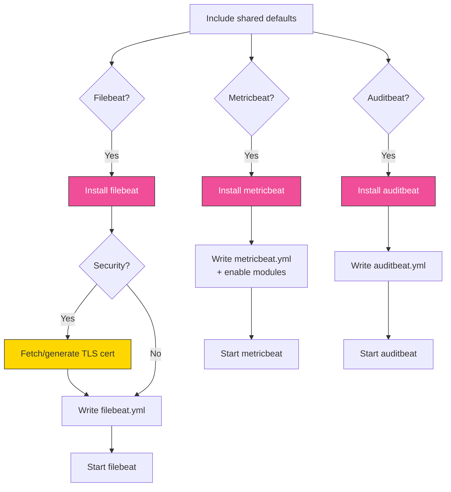
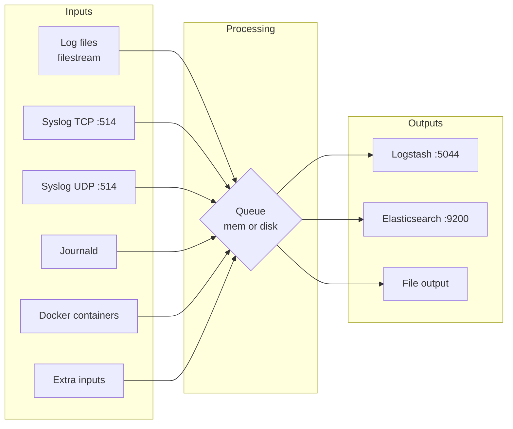

# beats

Ansible role for installing, configuring, and managing Elastic Beats (Filebeat, Metricbeat, Auditbeat). Handles syslog inputs (TCP/UDP), log file inputs with multiline support, journald inputs, Docker container logs, TLS certificate management, and output to Elasticsearch, Logstash, or file.

The role installs whichever Beat types are enabled (`beats_filebeat`, `beats_metricbeat`, `beats_auditbeat`) and configures each with its own YAML template. All three Beats share common settings for logging, TLS, and target hosts, while each has its own output destination and module configuration.

## Task flow



## Requirements

- Minimum Ansible version: `2.18`
- In a full-stack deployment, Elasticsearch (and optionally Logstash) should be running before applying this role

## Default Variables

### Service Selection

These booleans control which Beat agents are installed and configured. You can enable any combination on a single host.

```yaml
beats_filebeat: true
beats_auditbeat: false
beats_metricbeat: false
```

`beats_filebeat` is enabled by default. Auditbeat and Metricbeat are opt-in. Each Beat is independently installed, configured from its own template, and managed as a separate systemd service.

### Target Hosts

```yaml
beats_target_hosts:
  - localhost
```

List of Elasticsearch or Logstash hosts that Beats send data to. This is only used when `elasticstack_full_stack: false` -- in full-stack mode, hosts are auto-discovered from inventory groups (`elasticstack_elasticsearch_group_name` / `elasticstack_logstash_group_name`).

### Security

```yaml
beats_security: false
beats_ssl_verification_mode: certificate
```

`beats_security` enables TLS for all Beat-to-Elasticsearch and Beat-to-Logstash connections. When enabled, each Beat uses client certificates to authenticate. Although the default is `false`, in full-stack mode (`elasticstack_full_stack: true`) this is automatically set to `true` when `elasticstack_security` is `true`. Set `elasticstack_override_beats_tls: true` to prevent this automatic inheritance.

`beats_ssl_verification_mode` controls the TLS verification mode used for Elasticsearch output connections when `beats_security` is enabled. Valid values are `full` (verify certificate and hostname), `certificate` (verify certificate only), and `none` (skip verification). Logstash output always uses `full` verification regardless of this setting.

!!! warning
    The default passphrase `BeatsChangeMe` (see `beats_tls_key_passphrase` below) should be changed in any non-test deployment.

### Logging

These settings apply to all three Beat types (Filebeat, Metricbeat, Auditbeat).

```yaml
beats_logging: file
beats_logpath: /var/log/beats
beats_loglevel: info
beats_logging_keepfiles: 7
beats_logging_permissions: "0644"
```

`beats_logging` sets the logging destination. When set to `file`, the role creates the `beats_logpath` directory and each Beat writes to its own log file within it (e.g. `filebeat`, `auditbeat`, `metricbeat`).

`beats_loglevel` accepts `debug`, `info`, `warning`, `error`, or `critical`. This applies uniformly to all enabled Beats.

`beats_logging_keepfiles` controls how many rotated log files are retained per Beat. `beats_logging_permissions` sets the file mode on log files.

### Global Fields

```yaml
# beats_fields is not set by default
```

`beats_fields` is an optional list of field lines injected into every Filebeat input (log, syslog TCP, syslog UDP). It is not defined in defaults -- define it in your inventory or playbook variables when you need fields applied globally across all inputs. Each item is rendered as a raw YAML line inside the `fields:` block.

### Filebeat Configuration

#### Service and Output

```yaml
beats_filebeat_enable: true
beats_filebeat_output: logstash
beats_filebeat_loadbalance: true
beats_filebeat_elastic_monitoring: false
```

`beats_filebeat_enable` controls whether the Filebeat systemd service is started and enabled. Set to `false` to install and configure Filebeat without starting it.

`beats_filebeat_output` sets the output destination. Valid values are `logstash`, `elasticsearch`, or `file`. When set to `logstash`, events are sent to the Logstash Beats input port. When set to `elasticsearch`, events go directly to the Elasticsearch HTTP API. When set to `file`, events are written to disk (see `beats_filebeat_output_file_path` below).

`beats_filebeat_loadbalance` enables round-robin load balancing across multiple Logstash hosts. Only applies when `beats_filebeat_output` is `logstash`.

`beats_filebeat_elastic_monitoring` enables X-Pack monitoring metrics for the Filebeat process itself.

#### File Output Path

```yaml
# beats_filebeat_output_file_path is not set by default
# Falls back to "/tmp/filebeat-output" if unset
```

When `beats_filebeat_output: file`, this controls the directory where Filebeat writes output files. The output filename is always `filebeat`. If left undefined, it defaults to `/tmp/filebeat-output`.

!!! tip
    The `file` output is useful for debugging pipelines -- you can inspect raw events before routing them to Elasticsearch or Logstash.

#### Log File Inputs

```yaml
beats_filebeat_log_input: true
beats_filebeat_log_inputs:
  messages:
    name: messages
    paths:
      - /var/log/messages
      - /var/log/syslog
```

`beats_filebeat_log_input` is the master switch for file-based log collection. When `false`, no log file inputs are rendered regardless of what `beats_filebeat_log_inputs` contains.

`beats_filebeat_log_inputs` is a dictionary where each key defines a separate Filebeat input. Every input must have a `name` and a `paths` list. You can optionally add `fields` (a dict of key-value pairs) and `multiline` configuration.

Example with custom fields and multiline:

```yaml
beats_filebeat_log_inputs:
  syslog:
    name: syslog
    paths:
      - /var/log/syslog
  nginx:
    name: nginx
    paths:
      - /var/log/nginx/access.log
    fields:
      app: nginx
      logtype: access
  java:
    name: java-app
    paths:
      - /var/log/myapp/*.log
    multiline:
      type: pattern
      pattern: '^[[:space:]]+(at|\.{3})[[:space:]]+\b|^Caused by:'
      negate: false
      match: after
```

!!! note
    Log inputs always use the `filestream` type with a unique `id` per input (derived from the dictionary key). Multiline settings are rendered under a `parsers:` block. This is the Filebeat 8.x+ `filestream` syntax; the legacy `log` type is no longer used.

#### MySQL Slow Query Log Input

```yaml
beats_filebeat_mysql_slowlog_input: false
```

Enables a dedicated `filestream` input for `/var/log/mysql/*-slow.log` with built-in multiline parsing (pattern: `^#[[:space:]]Time`). It adds custom fields `mysql.logtype: slowquery` with `fields_under_root: true` so the field appears at the document root, not nested under `fields`.

#### Filebeat Modules

```yaml
# beats_filebeat_modules is not set by default
```

When defined, this list of module names is passed to `filebeat modules enable <module>`. Example:

```yaml
beats_filebeat_modules:
  - system
  - nginx
```

#### Extra Inputs

```yaml
beats_filebeat_extra_inputs: []
```

A list of arbitrary Filebeat input configurations appended after all built-in inputs. Each item is a dictionary rendered as a complete YAML input block under `filebeat.inputs`. Use this for input types that the role does not have dedicated variables for (AWS S3, HTTP JSON, Redis, Kafka, etc.).

```yaml
beats_filebeat_extra_inputs:
  - type: aws-s3
    enabled: true
    queue_url: https://sqs.us-east-1.amazonaws.com/1234/queue
  - type: httpjson
    enabled: true
    config_version: 2
    request.url: https://api.example.com/logs
```

Each dict is passed through `to_nice_yaml` and indented into the inputs list, so you can use any valid Filebeat input configuration keys.

### Syslog Listeners

```yaml
beats_filebeat_syslog_tcp: false
beats_filebeat_syslog_tcp_port: 514
beats_filebeat_syslog_tcp_ssl: false
beats_filebeat_syslog_tcp_fields: {}

beats_filebeat_syslog_udp: false
beats_filebeat_syslog_udp_port: 514
beats_filebeat_syslog_udp_fields: {}
```

Enable TCP and/or UDP syslog listeners for receiving syslog messages from network devices and applications. Each listener binds to `0.0.0.0` on the configured port with a hardcoded `max_message_size` of `10MiB`.

`beats_filebeat_syslog_tcp_ssl` enables TLS on the TCP syslog input, using the same certificates configured in the TLS section below.

The `_fields` dictionaries add custom key-value fields to every event from that input. These are merged with `beats_fields` (if defined). Use them to tag events by protocol or source:

```yaml
beats_filebeat_syslog_tcp_fields:
  source_protocol: tcp
  environment: production

beats_filebeat_syslog_udp_fields:
  source_protocol: udp
```

!!! tip
    If both TCP and UDP listeners use the same port (default 514), they coexist without conflict since they are different protocols.

### Journald Input

```yaml
beats_filebeat_journald: false
beats_filebeat_journald_inputs:
  everything:
    id: everything
```

`beats_filebeat_journald` enables reading from the systemd journal. `beats_filebeat_journald_inputs` is a dictionary where each key defines an input with a required `id` and optional `include_matches` filters.

Example -- filter to specific systemd units:

```yaml
beats_filebeat_journald_inputs:
  everything:
    id: everything
  vault:
    id: service-vault
    include_matches:
      - _SYSTEMD_UNIT=vault.service
```

### Docker Input

```yaml
beats_filebeat_docker: false
beats_filebeat_docker_ids: "*"
```

`beats_filebeat_docker` enables collection of Docker container logs via a `filestream` input reading from `/var/lib/docker/containers/`. Set `beats_filebeat_docker_ids` to `"*"` for all containers or a specific container ID to limit collection.

When enabled, the `add_docker_metadata` processor is automatically added alongside the default `add_host_metadata` and `add_cloud_metadata` processors.

### Filebeat Queue

```yaml
beats_queue_type: mem
beats_queue_disk_path: ""
beats_queue_disk_max_size: 1GB
```

`beats_queue_type` sets the internal event queue. `mem` is the default in-memory queue -- fastest, but events are lost on restart. `disk` uses a disk-backed queue that survives restarts at the cost of throughput.

`beats_queue_disk_path` overrides the directory for the disk queue. When empty, Filebeat uses its default data directory. `beats_queue_disk_max_size` caps the disk queue size before Filebeat applies backpressure to inputs.

### Auditbeat Configuration

```yaml
beats_auditbeat_enable: true
beats_auditbeat_setup: true
beats_auditbeat_output: elasticsearch
beats_auditbeat_loadbalance: true
```

`beats_auditbeat_enable` controls whether the Auditbeat systemd service is started. Set to `false` in containers or environments where the `auditd` kernel module is unavailable.

`beats_auditbeat_setup` runs the Auditbeat setup command on first install, loading dashboards and index templates into Elasticsearch. This only runs when `beats_auditbeat_output` is `elasticsearch` -- if outputting to Logstash, setup is skipped because it requires a direct Elasticsearch connection.

`beats_auditbeat_output` sets the output destination: `elasticsearch` or `logstash`. `beats_auditbeat_loadbalance` enables round-robin across multiple output hosts.

The Auditbeat template configures four modules that are not variable-controlled:

- **auditd** -- Linux audit framework, loads rules from `${path.config}/audit.rules.d/*.conf`
- **file_integrity** -- monitors `/bin`, `/usr/bin`, `/sbin`, `/usr/sbin`, `/etc` recursively
- **system (packages)** -- inventories installed packages every 2 minutes
- **system (state)** -- captures host, login, process, socket, and user state every 12 hours, with `user.detect_password_changes: true`

### Metricbeat Configuration

```yaml
beats_metricbeat_enable: true
beats_metricbeat_output: elasticsearch
beats_metricbeat_modules:
  - system
beats_metricbeat_loadbalance: true
```

`beats_metricbeat_enable` controls whether the Metricbeat systemd service is started.

`beats_metricbeat_output` sets the output destination: `elasticsearch` or `logstash`. `beats_metricbeat_loadbalance` enables round-robin across multiple output hosts.

`beats_metricbeat_modules` lists Metricbeat modules to enable. Modules are activated via `metricbeat modules enable <module>`, with a `creates:` guard on `/etc/metricbeat/modules.d/<module>.yml` for idempotency.

```yaml
beats_metricbeat_modules:
  - system
  - docker
  - nginx
```

### TLS Certificates

#### Auto-generated certificates (default)

```yaml
beats_cert_source: elasticsearch_ca
beats_tls_key: "{{ beats_ca_dir }}/{{ inventory_hostname }}-beats.key"
beats_tls_cert: "{{ beats_ca_dir }}/{{ inventory_hostname }}-beats.crt"
beats_tls_cacert: "{{ beats_ca_dir }}/ca.crt"
beats_tls_key_passphrase: BeatsChangeMe
```

`beats_cert_source` controls where TLS certificates come from. The default `elasticsearch_ca` auto-generates certificates from the Elasticsearch CA. Set to `external` to provide your own certificates.

`beats_tls_key`, `beats_tls_cert`, and `beats_tls_cacert` are the paths where the generated (or installed) certificates live on the managed node. The defaults use `beats_ca_dir`, which is set to `/etc/beats/certs` in full-stack mode or `/opt/ca` otherwise.

`beats_tls_key_passphrase` is the passphrase protecting the Beat private key. Used in all Beat templates when TLS is enabled.

!!! warning
    Change `beats_tls_key_passphrase` from its default value `BeatsChangeMe` in production deployments.

#### External certificates

These variables are only used when `beats_cert_source: external`.

```yaml
beats_tls_certificate_file: ""
beats_tls_key_file: ""
beats_tls_ca_file: ""
beats_tls_remote_src: false
```

`beats_tls_certificate_file` is the path to your PEM certificate. `beats_tls_key_file` is the path to the private key -- if left empty, it is auto-derived from the certificate path. `beats_tls_ca_file` is the CA certificate -- if left empty and the certificate PEM contains multiple blocks, the CA is auto-extracted from the chain.

`beats_tls_remote_src` controls where the cert files are located. Set to `false` (default) when files are on the Ansible controller and need to be copied to managed nodes. Set to `true` when files already exist on managed nodes.

#### Inline PEM content

As an alternative to file paths, you can provide certificate content directly as PEM strings. When set, these take precedence over the corresponding file path variables.

```yaml
beats_tls_certificate_content: ""
beats_tls_key_content: ""
beats_tls_ca_content: ""
```

### Certificate Lifecycle

```yaml
beats_cert_validity_period: 1095
beats_cert_expiration_buffer: 30
beats_cert_will_expire_soon: false
```

`beats_cert_validity_period` sets how many days generated certificates are valid (default: 3 years). `beats_cert_expiration_buffer` triggers certificate renewal this many days before expiry.

`beats_cert_will_expire_soon` is an internal flag set by the role when certificates are within the expiration buffer. Do not set this manually.

## Operational notes

### Filebeat data flow



### SSL verification modes differ by output

When `beats_security` is enabled, the TLS `verification_mode` differs depending on the output target:

- **Elasticsearch output**: uses `beats_ssl_verification_mode` (defaults to `certificate`)
- **Logstash output**: always `full` -- full certificate and hostname verification, regardless of `beats_ssl_verification_mode`

This is because Beats often connect to Elasticsearch on localhost or via IP where hostname verification would fail, while Logstash connections typically go over the network where full verification is appropriate.

### Filebeat processors

The Filebeat template always includes `add_host_metadata` and `add_cloud_metadata` processors. When the Docker input is enabled, `add_docker_metadata` is also added. Auditbeat and Metricbeat include the same two base processors.

### Handler double guard

Each Beat's restart handler requires both the install flag AND the enable flag to fire:

- Filebeat: `beats_filebeat | bool` AND `beats_filebeat_enable | bool`
- Auditbeat: `beats_auditbeat | bool` AND `beats_auditbeat_enable | bool`
- Metricbeat: `beats_metricbeat | bool` AND `beats_metricbeat_enable | bool`

This prevents restart attempts on Beats that are installed but intentionally disabled (e.g. Auditbeat in containers where the audit kernel module is not available).

### TCP/UDP syslog max message size

Both the TCP and UDP syslog inputs set `max_message_size: 10MiB`. This is hardcoded in the template, not configurable via a variable.

### Container cache cleanup

Like other roles in the collection, Beats runs `rm -rf /var/cache/*` in container environments to free disk space for Elasticsearch replica allocation.

## Tags

| Tag | Purpose |
|-----|---------|
| `beats_configuration` | All Beats configuration tasks |
| `beats_filebeat_configuration` | Filebeat-specific configuration |
| `beats_metricbeat_configuration` | Metricbeat-specific configuration |
| `beats_auditbeat_configuration` | Auditbeat-specific configuration |
| `certificates` | Run all certificate-related tasks |
| `configuration` | General configuration tasks |
| `renew_beats_cert` | Renew Beat certificates |
| `renew_ca` | Renew the certificate authority |

## License

GPL-3.0-or-later

## Author

Thomas Widhalm, Netways GmbH
