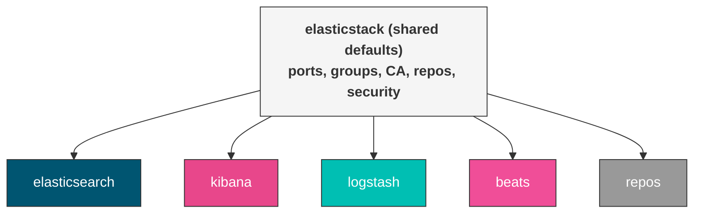

# elasticstack (shared defaults)

Shared defaults for the `oddly.elasticstack` collection. These variables are used across all roles (elasticsearch, kibana, logstash, beats, repos) to provide consistent configuration for inventory group names, ports, TLS certificate authority settings, and repository configuration.

You typically set these in `group_vars/all.yml` so they apply to every host in your inventory.



## Default Variables

### General Settings

```yaml
elasticstack_release: 8
elasticstack_full_stack: true
elasticstack_security: true
elasticstack_no_log: true
```

`elasticstack_release`
:   Major version of the Elastic Stack to install (`8` or `9`). Controls which package repository is configured and which configuration format is generated by templates. Set to `9` for new deployments; keep at `8` for existing clusters until you're ready to upgrade.

`elasticstack_full_stack`
:   When `true`, roles auto-discover each other through inventory groups and share TLS certificates via the central CA. When `false`, each role operates standalone — you must provide explicit host lists (e.g. `beats_target_hosts`, `logstash_elasticsearch_hosts`) instead of relying on group lookups.

`elasticstack_security`
:   Global toggle for security features: TLS encryption, authentication, and RBAC. Individual roles have their own security flags (`elasticsearch_security`, `beats_security`, etc.) that default based on this value. Disabling this turns off TLS and authentication across the entire stack.

    !!! warning
        Only disable security for isolated development environments. Production deployments should always have security enabled.

`elasticstack_no_log`
:   Suppress sensitive output (passwords, tokens, certificate contents) in Ansible logs. Set to `false` when debugging authentication or certificate issues — but remember to re-enable it afterward.

### Inventory Group Names

```yaml
elasticstack_elasticsearch_group_name: elasticsearch
elasticstack_logstash_group_name: logstash
elasticstack_kibana_group_name: kibana
```

These variables tell each role where to find the other services in your Ansible inventory. Override them if your inventory uses different group names. For example, if your Elasticsearch hosts are in a group called `es_cluster`:

```yaml
elasticstack_elasticsearch_group_name: es_cluster
```

### Network Ports

```yaml
elasticstack_elasticsearch_http_port: 9200
elasticstack_kibana_port: 5601
elasticstack_beats_port: 5044
```

`elasticstack_elasticsearch_http_port`
:   The HTTP API port that Elasticsearch listens on. All roles use this when constructing URLs to reach Elasticsearch (health checks, password setup, index operations). Change this if you run Elasticsearch on a non-standard port.

`elasticstack_kibana_port`
:   The port Kibana's web interface listens on. Used by Beats templates when configuring `setup.kibana.host`.

`elasticstack_beats_port`
:   The port Logstash opens for incoming Beats connections (Beats input plugin). Filebeat, Metricbeat, and Auditbeat connect to this port when their output is set to `logstash`.

### Certificate Authority

The collection manages a full PKI rooted in a CA generated by the Elasticsearch `certutil` tool. The CA lives on one host and all roles fetch their service certificates from it.

```yaml
elasticstack_ca_host: "{{ (groups[elasticstack_elasticsearch_group_name] | default([inventory_hostname]))[0] }}"
elasticstack_ca_dir: /opt/es-ca
elasticstack_ca_name: "CN=Elastic Certificate Tool Autogenerated CA"
elasticstack_ca_pass: PleaseChangeMe
elasticstack_ca_validity_period: 1095
elasticstack_ca_expiration_buffer: 30
elasticstack_ca_will_expire_soon: false
```

`elasticstack_ca_host`
:   The host that holds the CA private key and generates certificates for all services. Defaults to the first host in the `elasticsearch` inventory group. All certificate generation and signing tasks delegate to this host.

`elasticstack_ca_dir`
:   Directory where the CA certificate (`ca.p12`) and extracted public cert (`ca.crt`) are stored.

`elasticstack_ca_name`
:   The subject (CN) embedded in the generated CA certificate. Change this if you want a more descriptive CA name in your certificate chain.

`elasticstack_ca_pass`
:   Passphrase protecting the CA private key. Used when generating the CA and when signing service certificates.

    !!! warning
        The default `PleaseChangeMe` must be changed in production. Store the real passphrase in Ansible Vault or a secrets manager.

`elasticstack_ca_validity_period`
:   How long the CA certificate is valid, in days. Default is 1095 (3 years). Service certificates inherit this validity period.

`elasticstack_ca_expiration_buffer`
:   Days before CA expiry to trigger automatic renewal. When the CA is within this buffer, the next playbook run regenerates the CA and all dependent service certificates. Default 30 days gives you a month's warning.

`elasticstack_ca_will_expire_soon`
:   Internal flag set by the expiry check task. Do not set this manually — it is computed at runtime.

### Repository Configuration

```yaml
elasticstack_enable_repos: true
elasticstack_repo_base_url: "{{ lookup('env', 'ELASTICSTACK_REPO_BASE_URL') | default('https://artifacts.elastic.co', true) }}"
elasticstack_repo_key: "{{ elasticstack_repo_base_url }}/GPG-KEY-elasticsearch"
elasticstack_rpm_workaround: false
```

`elasticstack_enable_repos`
:   Let the `repos` role manage Elastic APT/YUM repositories. Set to `false` if you manage package repositories through another mechanism (Satellite, Pulp, Foreman, or manual repo files).

`elasticstack_repo_base_url`
:   Base URL for Elastic package repositories. The default reads from the `ELASTICSTACK_REPO_BASE_URL` environment variable, falling back to `https://artifacts.elastic.co`. Override this to point at a local mirror, caching proxy, or air-gapped repository.

    !!! tip
        For air-gapped environments, set up a caching reverse proxy (Nginx, Caddy, Nexus) that mirrors `artifacts.elastic.co` and point this variable at it.

`elasticstack_repo_key`
:   URL to the GPG key used to verify package signatures. Defaults to `<base_url>/GPG-KEY-elasticsearch`. Only override this if your mirror hosts the GPG key at a different path.

`elasticstack_rpm_workaround`
:   On RHEL 9+ and derivatives, strict default crypto policies can prevent RPM signature verification of Elastic packages ([elasticsearch#85876](https://github.com/elastic/elasticsearch/issues/85876)). When `true`, the repos role runs `update-crypto-policies --set LEGACY` to relax the policy. Only enable this if RPM key import fails on EL 9+.

### Other Settings

```yaml
elasticstack_initial_passwords: /usr/share/elasticsearch/initial_passwords
elasticstack_override_beats_tls: false
```

`elasticstack_initial_passwords`
:   Path to the file containing initial Elasticsearch passwords generated by `elasticsearch-setup-passwords` during first security setup. All roles read the `elastic` user password from this file via `delegate_to` to the CA host.

`elasticstack_override_beats_tls`
:   When `true`, Beats roles use TLS certificates generated from the Elasticsearch CA instead of managing their own CA. Useful when you want a single CA for the entire stack.

## Operational Notes

### Role import guard

The shared role sets `_elasticstack_role_imported: true` after running. Every other role checks this before importing:

```yaml
when: not hostvars[inventory_hostname]._elasticstack_role_imported | default(false)
```

This prevents the shared role from running multiple times when several roles are applied in sequence. If you run separate plays for install and upgrade in the same playbook, reset the guard between plays:

```yaml
- name: Reset shared role guard
  ansible.builtin.set_fact:
    _elasticstack_role_imported: false
```

### CA host selection

The CA host defaults to the first host in the `elasticsearch` inventory group. If that group doesn't exist (standalone Logstash deployment), it falls back to the first host in the `logstash` group, then to `inventory_hostname`. All certificate operations delegate to this host.

### Password file format

The initial passwords file is generated by `elasticsearch-setup-passwords auto -b` and contains:

```
Changed password for user apm_system
PASSWORD apm_system = <password>
Changed password for user elastic
PASSWORD elastic = <password>
...
```

The shared `fetch_password.yml` task extracts a specific user's password with `grep` + `awk` and registers it as an Ansible fact.

### OS-specific version separator

Package version pinning uses different separators per OS family:

| OS Family | Separator | Example |
|-----------|-----------|---------|
| Debian | `=` | `elasticsearch=9.0.2` |
| RedHat | `-` | `elasticsearch-9.0.2` |

### Shared certificate tasks

The `certs/` directory contains reusable tasks imported by all roles:

| Task | Purpose |
|------|---------|
| `ca_ensure.yml` | Create CA directory and generate CA P12 if missing |
| `ca_extract_public.yml` | Extract `ca.crt` from CA P12 |
| `cert_generate.yml` | Generate a service certificate (P12 or PEM) with SANs |
| `cert_check_expiry.yml` | Check certificate expiry and set `*_will_expire_soon` fact |
| `cert_backup.yml` | Create timestamped backup of certificates before renewal |
| `cert_distribute.yml` | Fetch cert from CA host to controller, then copy to target node |
| `cert_validate.yml` | Validate external certificates: format detection (PEM/P12 via openssl probing), key match, expiry check, SAN warning |
| `fetch_password.yml` | Extract a user's password from the initial passwords file |

## Tags

| Tag | Purpose |
|-----|---------|
| `certificates` | Run all certificate-related tasks |
| `renew_ca` | Renew the certificate authority |
| `renew_es_cert` | Renew Elasticsearch certificates |
| `renew_kibana_cert` | Renew Kibana certificates |
| `renew_logstash_cert` | Renew Logstash certificates |
| `renew_beats_cert` | Renew Beats certificates |

## License

GPL-3.0-or-later
