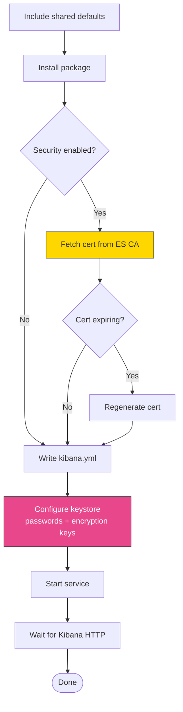

# kibana

Ansible role for installing, configuring, and managing Kibana. Handles service management, TLS encryption for the Kibana web UI, Elasticsearch connection setup, and certificate management.

In a full-stack deployment, this role runs after `elasticsearch`. It connects to Elasticsearch using the `kibana_system` user with the password generated during security setup, and optionally serves the Kibana web UI over HTTPS with its own TLS certificate.

## Task flow



## Requirements

- Minimum Ansible version: `2.18`
- The `elasticsearch` role must have completed (Kibana needs a running ES cluster to connect to)

## Default Variables

### Service Management

```yaml
kibana_enable: true
kibana_manage_yaml: true
kibana_config_backup: false
```

`kibana_enable` controls whether the Kibana service is enabled and started. Set to `false` if you want to install and configure Kibana without starting it (for example, during an image build).

`kibana_manage_yaml` lets the role write `/etc/kibana/kibana.yml` from its template. Set to `false` if you manage the configuration file yourself through another mechanism. When disabled, the role still handles package installation, certificates, keystore, and service management.

`kibana_config_backup` creates a timestamped backup of `kibana.yml` before overwriting it. Useful for tracking configuration drift.

### Elasticsearch Connection

```yaml
# kibana_elasticsearch_hosts: (undefined by default)
kibana_security: true
kibana_sniff_on_start: false
kibana_sniff_on_connection_fault: false
```

`kibana_elasticsearch_hosts` is the list of Elasticsearch hosts that Kibana connects to. You rarely need to set this explicitly. The role resolves it through a three-level fallback:

1. If `kibana_elasticsearch_hosts` is set in your inventory, that value is used as-is.
2. Otherwise, if the `elasticstack_elasticsearch_group_name` inventory group exists, the role builds the host list from that group's members.
3. If neither is available, the role falls back to `["localhost"]`.

!!! tip
    In most full-stack deployments the automatic group-based resolution (option 2) does the right thing. You only need to set `kibana_elasticsearch_hosts` explicitly when Kibana runs on a host outside the Elasticsearch inventory group, or when you need to point at specific ES nodes rather than all of them.

`kibana_security` enables authenticated, encrypted connections to Elasticsearch. When `true`, Kibana connects over HTTPS using the `kibana_system` user and the password from the Elasticsearch security setup. The CA certificate is deployed automatically from the ES CA host.

`kibana_sniff_on_start` and `kibana_sniff_on_connection_fault` control Elasticsearch node discovery. When enabled, Kibana queries the ES cluster for the full list of nodes at startup or when a connection drops. These settings only apply to Elastic Stack versions prior to 9.x (Kibana 9.x removed sniffing support).

### TLS for the Kibana Web Interface

These settings control HTTPS on the Kibana frontend itself (what users access in their browser). This is entirely separate from the TLS used to connect to Elasticsearch, which is managed by `kibana_security`.

```yaml
kibana_tls: false
kibana_tls_key_passphrase: PleaseChangeMe
```

`kibana_tls` enables TLS on the Kibana web interface. When `false` (the default), Kibana serves over plain HTTP on port 5601. Most deployments terminate TLS at a reverse proxy instead of enabling this.

!!! warning
    `kibana_tls_key_passphrase` defaults to `PleaseChangeMe`. If you enable `kibana_tls` with the default CA-generated certificates, change this passphrase. It protects the PKCS12 keystore that holds Kibana's TLS private key. If `elasticstack_cert_pass` is defined globally, the role uses that instead of this per-role default.

### Server Protocol

```yaml
# kibana_server_protocol: ""  (commented out / undefined by default)
```

`kibana_server_protocol` sets `server.protocol` in `kibana.yml`. Accepted values are `http1` or `http2`. Kibana 9.x auto-enables HTTP/2 when TLS is on, which can break some reverse proxy setups. Set to `http1` to force HTTP/1.1. When left undefined or empty, the Kibana default applies.

!!! note
    This variable is commented out in the role defaults. To use it, define it explicitly in your inventory or playbook variables.

### Node.js Memory Tuning

```yaml
kibana_node_max_old_space_size: ""
```

`kibana_node_max_old_space_size` sets the V8 `--max-old-space-size` option in `/etc/kibana/node.options`, controlling the maximum heap size in megabytes for the Kibana Node.js process. When empty (the default), the package default is left in place. When set, the role uncomments or updates the existing line in `node.options`.

!!! tip
    On hosts with limited memory, setting this to a value like `1024` (1 GB) prevents Kibana from consuming too much RAM. On large deployments with many dashboards and concurrent users, increasing it to `2048` or higher can prevent out-of-memory crashes. The Kibana package default is typically 1.5 GB.

### Keystore Encryption

```yaml
kibana_keystore_password: ""
```

`kibana_keystore_password` sets the password for encrypting the Kibana keystore file (`/etc/kibana/kibana.keystore`). When empty (the default), the keystore is created without encryption, matching Kibana's out-of-the-box behavior. When set, the password file is written to `/etc/kibana/.keystore_password` and a systemd override injects the `KBN_KEYSTORE_PASSPHRASE_FILE` environment variable.

The keystore holds sensitive values that the role manages automatically: `elasticsearch.password`, `server.ssl.keystore.password`, `xpack.security.encryptionKey`, and `xpack.encryptedSavedObjects.encryptionKey`.

### Certificate Source

```yaml
kibana_cert_source: elasticsearch_ca
```

`kibana_cert_source` determines where Kibana's TLS certificate comes from. Two modes are supported:

- `elasticsearch_ca` (default) -- the role fetches a certificate from the Elasticsearch CA that was created during the `elasticsearch` role's security setup. This is fully automatic and requires no additional configuration.
- `external` -- you provide your own certificate files using the variables below.

### External Certificate Files

These variables are only used when `kibana_cert_source: external`.

```yaml
kibana_tls_certificate_file: ""
kibana_tls_key_file: ""
kibana_tls_certificate_passphrase: ""
kibana_tls_ca_file: ""
kibana_tls_remote_src: false
```

`kibana_tls_certificate_file` is the path to a TLS certificate in PEM (`.crt`/`.pem`) or PKCS12 (`.p12`/`.pfx`) format. The format is auto-detected by probing the file content with `openssl` (not from the file extension).

`kibana_tls_key_file` is the path to the corresponding private key. For PEM certificates, if left empty, the role derives the key path from the certificate path by changing the extension. For PKCS12, this is ignored (the key is inside the P12 file).

`kibana_tls_certificate_passphrase` is the passphrase for an encrypted PEM key or a password-protected P12 file. Leave empty for unencrypted files.

`kibana_tls_ca_file` is the path to the CA certificate. If your PEM certificate file contains a full chain (multiple PEM blocks), the CA is auto-extracted and this can be left empty.

`kibana_tls_remote_src` controls where the role looks for the certificate files. When `false` (the default), files are on the Ansible controller and get copied to the managed node. When `true`, files are expected to already exist on the managed node.

### Inline PEM Content

As an alternative to file paths, you can embed certificate material directly in variables. When set, these take precedence over the corresponding `_file` variables. Only PEM format is supported (PKCS12 is binary and not suitable for YAML strings).

```yaml
kibana_tls_certificate_content: ""
kibana_tls_key_content: ""
kibana_tls_ca_content: ""
```

### Certificate Lifecycle

```yaml
kibana_cert_validity_period: 1095
kibana_cert_expiration_buffer: 30
kibana_cert_will_expire_soon: false
```

`kibana_cert_validity_period` sets the validity period in days for certificates generated by the Elasticsearch CA. The default of 1095 days is roughly three years.

`kibana_cert_expiration_buffer` is how many days before expiry the role triggers automatic certificate renewal. With the default of 30, a certificate with 29 days remaining will be regenerated on the next playbook run.

`kibana_cert_will_expire_soon` is an internal flag set by the role during execution. Do not set it manually.

### Extra Configuration

The template supports injecting arbitrary configuration lines into `kibana.yml` via `kibana_extra_config`:

```yaml
kibana_extra_config: |
  server.host: "127.0.0.1"
  monitoring.ui.enabled: false
```

This variable is not defined in the role defaults (so it is undefined by default and produces no output). Any YAML you put here is appended verbatim to the end of the generated `kibana.yml`.

!!! tip
    Use `kibana_extra_config` for any Kibana setting not covered by a dedicated variable, such as `server.host`, `server.basePath`, `monitoring.ui.enabled`, or `xpack.reporting.roles.enabled`.

### Internal Variables

```yaml
kibana_freshstart:
  changed: false
```

`kibana_freshstart` tracks whether the current run is a fresh installation. The role registers this from the "Start Kibana" task. Do not set it manually. It gates the restart handler: on a first run the service starts naturally, so a handler restart would be redundant.

## Operational Notes

### Encryption keys

The role generates two persistent encryption keys on the CA host during security setup:

- `xpack.security.encryptionKey` -- used for session cookies and other security tokens.
- `xpack.encryptedSavedObjects.encryptionKey` -- used for encrypting saved objects like alert rules and connector credentials.

Both keys are 36-byte base64 values generated with `openssl rand` and stored in `{{ elasticstack_ca_dir }}/encryption_key` and `savedobjects_encryption_key`. They use a `creates:` guard so they are generated once and never overwritten. Losing these keys would invalidate all encrypted saved objects in the cluster.

### Localhost TLS verification

When Kibana connects to Elasticsearch on `localhost`, hostname verification would fail because the ES certificate contains the node's real hostname, not `localhost`. The template detects this and sets `elasticsearch.ssl.verificationMode: certificate` (verify the certificate chain only, skip hostname check). For non-localhost connections, full verification is used.

### Server binding

Kibana binds to `0.0.0.0` (all interfaces) by default. This is hardcoded in the template, not configurable via a dedicated variable. To restrict binding, use `kibana_extra_config`:

```yaml
kibana_extra_config: |
  server.host: "127.0.0.1"
```

### Public base URL

The template sets `server.publicBaseUrl` automatically from `elasticstack_kibana_host` (falling back to `ansible_facts.fqdn`) and `elasticstack_kibana_port` (default `5601`). The protocol is derived from `kibana_tls`. Override `elasticstack_kibana_host` in your inventory if the FQDN is not the correct public-facing hostname (for example, when behind a load balancer).

### Readiness wait

The role waits for Kibana's `/api/status` endpoint with an explicit 300-second timeout (60 retries at 5-second intervals). It also checks that the `kibana` systemd service is still active on each retry, failing immediately with journal output if the service crashes. Kibana can take several minutes to start on first run as it creates system indices and generates browser bundles.

### Handler guard

The "Restart Kibana" handler does not fire on fresh installs (guarded by `kibana_freshstart.changed`). On a first run, the service starts naturally during the "Start Kibana" task, so a handler restart would be redundant and could cause a brief outage during initial index creation.

### Three-tier certificate backup

During certificate renewal, the role backs up the existing certificate to three locations before replacing it:

1. On the Kibana node itself (`/etc/kibana/certs/`)
2. On the CA host (the P12 file used to generate the cert)
3. On the Ansible controller (fetched copy)

This provides recovery options if renewal causes issues.

## Tags

| Tag | Purpose |
|-----|---------|
| `certificates` | Run all certificate-related tasks |
| `renew_ca` | Renew the certificate authority |
| `renew_kibana_cert` | Renew only the Kibana certificate |

## License

GPL-3.0-or-later

## Author

Netways GmbH
