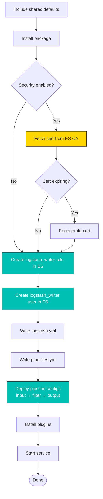

# logstash

Ansible role for installing, configuring, and managing Logstash. Handles pipeline configuration (inputs, filters, outputs), TLS certificate management, Elasticsearch user/role creation for the `logstash_writer` account, queue management, and plugin installation.

In a full-stack deployment, this role runs after `elasticsearch`. It creates a dedicated `logstash_writer` user and role in Elasticsearch with the minimum privileges needed to write indices, then configures a pipeline that receives events from Beats on port 5044 and writes them to Elasticsearch. The role supports three certificate sources: fetching from the Elasticsearch CA (default), generating standalone certificates, or using externally-provided certificates.

## Task flow



## Requirements

- Minimum Ansible version: `2.18`
- The `elasticsearch` role must have completed (Logstash needs ES for user/role creation and output)

## Default Variables

### Service Management

```yaml
logstash_enable: true
logstash_manage_yaml: true
logstash_config_backup: false
```

`logstash_enable`
:   Controls whether the Logstash systemd service is started and enabled at boot. Set to `false` if you want to install and configure Logstash without starting it — useful when you need to complete other setup steps before the service comes up.

`logstash_manage_yaml`
:   When `true`, the role templates `/etc/logstash/logstash.yml` on every run. Set to `false` if you manage that file through another mechanism (a separate Ansible template, a config management tool, or manual edits). With this disabled, all `logstash_config_*`, `logstash_http_*`, `logstash_pipeline_buffer_type`, and `logstash_extra_config` variables have no effect since they are only rendered into `logstash.yml`.

`logstash_config_backup`
:   Create a timestamped backup of `logstash.yml` and `pipelines.yml` before overwriting. Handy during initial tuning, but generates clutter in `/etc/logstash/` over time. The backups are standard Ansible `.bak` files.

### Configuration Reload

```yaml
logstash_config_autoreload: true
# logstash_config_autoreload_interval: 3s
```

`logstash_config_autoreload`
:   When enabled, Logstash watches for pipeline configuration file changes and reloads them without a full service restart. Safe to leave on in production. When disabled, the role uses a separate restart handler for pipeline changes — any modification to `10-input.conf`, `50-filter.conf`, or `90-output.conf` triggers a full Logstash restart.

`logstash_config_autoreload_interval`
:   How often Logstash checks for configuration file changes. Only applies when `logstash_config_autoreload` is enabled. Uncomment and set to a duration string like `3s`, `10s`, or `1m`. The package default is `3s`.

### Paths

```yaml
logstash_config_path_data: /var/lib/logstash
logstash_config_path_logs: /var/log/logstash
```

`logstash_config_path_data`
:   Where Logstash stores persistent data: the persisted queue files, the dead letter queue, sincedb tracking files, and UUID state. Point this to a fast disk with enough space for your queue size if using `queue.type: persisted`.

`logstash_config_path_logs`
:   Directory for Logstash log files (the main log, the slow log, and any deprecation logs). Ensure the `logstash` user has write access if you change this from the default.

### API Endpoint

```yaml
# logstash_http_host: "127.0.0.1"
# logstash_http_port: 9600-9700
```

`logstash_http_host`
:   Bind address for the Logstash monitoring API (`api.http.host` in `logstash.yml`). Defaults to `127.0.0.1` (localhost only). Set to `0.0.0.0` to expose the API on all interfaces, which is required if you monitor Logstash from a remote Metricbeat or a load balancer health check.

`logstash_http_port`
:   Port or port range for the Logstash monitoring API (`api.http.port`). The default `9600-9700` lets Logstash pick the first available port in that range, which avoids conflicts when running multiple instances on the same host.

!!! note
    Both `logstash_http_host` and `logstash_http_port` are only written to `logstash.yml` when explicitly defined. When left commented out, Logstash uses its built-in defaults (`127.0.0.1` and `9600-9700`).

### JVM Configuration

```yaml
logstash_heap: ""
```

`logstash_heap`
:   JVM heap size for Logstash, specified as a JVM memory string (e.g. `1g`, `512m`, `4g`). When set, the role edits `/etc/logstash/jvm.options` to use this value for both `-Xms` and `-Xmx`. When left empty (the default), the package default heap size (usually `1g`) is used unchanged. The default `1g` is adequate for light workloads and testing. For production pipelines with complex grok patterns, large batch sizes, or multiple pipelines, increase to `4g`-`8g`. Monitor JVM heap usage via the Logstash monitoring API or Metricbeat before sizing.

### Pipeline Buffer Type

```yaml
# logstash_pipeline_buffer_type: ""
```

`logstash_pipeline_buffer_type`
:   Controls the `pipeline.buffer.type` setting in `logstash.yml`. Accepts `direct` or `heap`. Only written when explicitly defined.

!!! note "9.x behaviour change"
    Logstash 9.x changed the default buffer type from `direct` (off-heap) to `heap` (on-heap). If you are upgrading from 8.x with tightly-tuned heap sizing, the additional on-heap pressure may cause garbage collection pauses or out-of-memory errors. Set this explicitly to `direct` to preserve 8.x behaviour, or increase `logstash_heap` to compensate.

### Pipeline Management

```yaml
logstash_manage_pipelines: true
logstash_no_pipelines: false
logstash_queue_type: persisted
logstash_queue_max_bytes: 1gb
```

`logstash_manage_pipelines`
:   When `true`, the role templates `pipelines.yml` and deploys pipeline config files to `/etc/logstash/conf.d/main/`. Set to `false` if you deploy pipeline configs through another mechanism (CI/CD, a separate Ansible role, or Logstash's centralized pipeline management). When disabled, `logstash_queue_type`, `logstash_queue_max_bytes`, `logstash_custom_pipeline`, and all input/filter/output variables have no effect.

`logstash_no_pipelines`
:   Removes all pipeline configuration files and skips `pipelines.yml` templating. Use this when Logstash pipelines are managed entirely through Kibana's Centralized Pipeline Management or another external tool and you want a clean `/etc/logstash/conf.d/`.

`logstash_queue_type`
:   Queue type for the `main` pipeline, written to `pipelines.yml` (not `logstash.yml`). Use `persisted` for disk-backed queues that survive Logstash restarts — recommended for production to avoid data loss during crashes or upgrades. Use `memory` for in-memory queues that are faster but lose all buffered events on restart.

`logstash_queue_max_bytes`
:   Maximum size of the persisted queue before Logstash applies backpressure to inputs (stops accepting new events). Accepts Logstash size notation: `1gb`, `500mb`, etc. Size this based on your burst capacity needs and available disk space at `logstash_config_path_data`. Only meaningful when `logstash_queue_type` is `persisted`.

!!! tip
    Queue settings (`queue.type` and `queue.max_bytes`) are rendered into `pipelines.yml`, not `logstash.yml`. This is because Logstash supports multiple pipelines, each with its own queue. The role's default defines a single `main` pipeline.

### Custom Pipeline

```yaml
logstash_custom_pipeline: ""
```

`logstash_custom_pipeline`
:   A complete Logstash pipeline configuration string that replaces all generated input, filter, and output files. When set, the role writes this as a single `pipeline.conf` file and removes the three numbered files (`10-input.conf`, `50-filter.conf`, `90-output.conf`). When cleared, the role removes `pipeline.conf` and goes back to generating the standard numbered files. Use this when the role's input/filter/output variables are too limiting for your pipeline design.

Example:

```yaml
logstash_custom_pipeline: |
  input { stdin {} }
  filter { mutate { add_field => { "env" => "test" } } }
  output { stdout { codec => rubydebug } }
```

### Input Configuration

```yaml
logstash_input_beats: true
logstash_input_beats_port: 5044
logstash_input_beats_ssl: "{{ logstash_beats_tls | default(omit) }}"
# logstash_input_beats_client_auth: required
# logstash_input_beats_timeout: 60s

logstash_input_elastic_agent: false
logstash_input_elastic_agent_port: 5044
logstash_input_elastic_agent_ssl: true

logstash_extra_inputs: ""
```

`logstash_input_beats`
:   Enable the Beats input plugin, which listens for events from Filebeat, Metricbeat, Heartbeat, and other Beats agents. This is the primary ingest path for most Elastic Stack deployments.

`logstash_input_beats_port`
:   TCP port the Beats input binds to. All Beat agents in your fleet must target this port. If you also enable the Elastic Agent input, give it a different port to avoid conflicts.

`logstash_input_beats_ssl`
:   Enable TLS encryption on the Beats input. In full-stack mode (`elasticstack_full_stack: true`), this defaults to `true` automatically. Accepts the legacy variable name `logstash_beats_tls` for backwards compatibility. When enabled, the input requires certificate files in `logstash_certs_dir`.

`logstash_input_beats_client_auth`
:   Whether the Beats input requires clients to present a TLS certificate. Accepts `required` (clients must authenticate — the default), `optional` (certificates are validated if presented), or `none` (no client certificate required). Only relevant when `logstash_input_beats_ssl` is enabled.

=== "9.x"

    Renders as `ssl_client_authentication => required` in the Beats input block.

=== "8.x"

    Renders as `ssl_verify_mode => force_peer` (hardcoded; the variable has no effect in 8.x).

`logstash_input_beats_timeout`
:   Idle timeout for Beats connections. Connections with no data for this duration are closed. Accepts a duration string like `60s` or `300s`. When undefined, the Beats input uses its built-in default. Set this lower if you have many idle Beat agents holding open connections.

`logstash_input_elastic_agent`
:   Enable the Elastic Agent input plugin. Elastic Agent uses a different protocol than Beats, so this is a separate input. Disabled by default.

`logstash_input_elastic_agent_port`
:   TCP port for the Elastic Agent input. Defaults to `5044`, which conflicts with the Beats input if both are enabled. Set one of them to a different port (e.g. `5045`) when using both inputs.

`logstash_input_elastic_agent_ssl`
:   Enable TLS on the Elastic Agent input. Defaults to `true`. Unlike the Beats input, client authentication is always `required` when SSL is enabled (not configurable via a variable).

`logstash_extra_inputs`
:   Raw Logstash input configuration appended after the Beats and Elastic Agent blocks. Use this for input plugins the role does not have dedicated variables for — HTTP, Kafka, S3, syslog, etc. The string is indented and inserted verbatim inside the `input { }` block.

Example:

```yaml
logstash_extra_inputs: |
  http {
    port => 8080
  }
  kafka {
    bootstrap_servers => "kafka1:9092,kafka2:9092"
    topics => ["logs"]
  }
```

### Filter Configuration

```yaml
logstash_filters: ""
logstash_filter_files: []
```

`logstash_filters`
:   Inline Logstash filter configuration inserted into the `filter { }` block in `50-filter.conf`. For simple pipelines where a few grok or mutate operations are sufficient. The string is indented and inserted verbatim. For complex filter chains, use `logstash_filter_files` instead.

Example:

```yaml
logstash_filters: |
  grok {
    match => { "message" => "%{SYSLOGLINE}" }
  }
  date {
    match => [ "timestamp", "MMM  d HH:mm:ss", "MMM dd HH:mm:ss" ]
  }
```

`logstash_filter_files`
:   List of filter configuration files to copy into `/etc/logstash/conf.d/main/`. Paths are relative to your playbook directory. Use this when your filters are too complex for an inline string or when you want to reuse filter files across playbooks. Files are copied as-is (not templated).

Example:

```yaml
logstash_filter_files:
  - files/logstash/syslog-filter.conf
  - files/logstash/nginx-filter.conf
```

!!! tip
    The `50-filter.conf` file is only created when at least one of `logstash_filters` or `logstash_filter_files` is set. If both are empty, no filter file is deployed and Logstash passes events straight from input to output.

### Output Configuration

```yaml
logstash_output_elasticsearch: true
logstash_elasticsearch_hosts: []
logstash_elasticsearch_index: ""
logstash_validate_after_inactivity: 300
logstash_sniffing: false
# logstash_sniffing_delay: 5
# logstash_sniffing_path: "/_nodes/http"
logstash_extra_outputs: ""
```

`logstash_output_elasticsearch`
:   Enable the Elasticsearch output plugin. Disable this if Logstash writes to a different destination (Kafka, S3, etc.) and you are providing all outputs via `logstash_extra_outputs`.

`logstash_elasticsearch_hosts`
:   Explicit list of Elasticsearch host addresses. When empty (the default), the role auto-discovers hosts from the inventory group defined by `elasticstack_elasticsearch_group_name` in full-stack mode, or falls back to `localhost` as a last resort. Each host is combined with `elasticstack_elasticsearch_http_port` (default `9200`) in the output config.

`logstash_elasticsearch_index`
:   Elasticsearch index name pattern for written events. Leave empty to use the Logstash default (`logstash-%{+YYYY.MM.dd}`). Set this if you want a custom index naming scheme, e.g. `app-logs-%{+YYYY.MM.dd}` or `%{[@metadata][beat]}-%{+YYYY.MM.dd}` to match Beats conventions.

`logstash_validate_after_inactivity`
:   Seconds of connection inactivity before Logstash re-validates an Elasticsearch connection. The default `300` (5 minutes) is appropriate for most deployments. Lower this if you are behind a load balancer or firewall that silently drops idle connections.

`logstash_sniffing`
:   Enable Elasticsearch node sniffing. When enabled, Logstash periodically queries the ES cluster for its full node list and distributes writes across all data nodes. Useful for large clusters where you don't want to enumerate every host in `logstash_elasticsearch_hosts`. Disable this (the default) in environments where Logstash cannot reach ES nodes directly (e.g. behind a reverse proxy).

`logstash_sniffing_delay`
:   Seconds between sniffing requests. Only applies when `logstash_sniffing` is enabled.

`logstash_sniffing_path`
:   Custom path for the sniffing API endpoint. Only needed if your Elasticsearch cluster is behind a reverse proxy that remaps API paths.

`logstash_extra_outputs`
:   Raw Logstash output configuration appended after the Elasticsearch output block. Use for additional destinations — file, Kafka, S3, HTTP, etc. The string is indented and inserted verbatim inside the `output { }` block.

Example:

```yaml
logstash_extra_outputs: |
  file {
    path => "/var/log/logstash/debug-%{+YYYY-MM-dd}.log"
  }
```

### Event Enrichment

```yaml
logstash_ident: true
logstash_ident_field_name: "[logstash][instance]"
logstash_pipeline_identifier: true
logstash_pipeline_identifier_field_name: "[logstash][pipeline]"
```

`logstash_ident`
:   Add a `mutate` filter that stamps every event with the Logstash instance's inventory hostname. In multi-node Logstash deployments, this lets you trace which node processed a given event. The field is added in `50-filter.conf`, before any custom filters. Disable this if your events already carry a processor identifier or if you want to minimise field additions.

`logstash_ident_field_name`
:   The field path where the Logstash hostname is written. Uses Logstash field reference syntax (square brackets for nested fields). The default `[logstash][instance]` creates a nested object `logstash.instance` in the event.

`logstash_pipeline_identifier`
:   Add a `mutate` filter that stamps every event with the pipeline name (`main`). Useful when you run multiple pipelines and want to know which one processed an event.

`logstash_pipeline_identifier_field_name`
:   The field path for the pipeline identifier. The default `[logstash][pipeline]` creates `logstash.pipeline` in the event.

### Elasticsearch User and Role

The role creates a dedicated Elasticsearch user and role for Logstash to use when writing indices. This follows the principle of least privilege — Logstash authenticates with a user that has only the permissions it needs, rather than the `elastic` superuser.

```yaml
logstash_create_role: true
logstash_role_name: logstash_writer
logstash_role_cluster_privileges:
  - manage_index_templates
  - monitor
  - manage_ilm
logstash_role_indicies_names:
  - "ecs-logstash*"
  - "logstash*"
  - "logs*"
logstash_role_indicies_privileges:
  - write
  - create
  - delete
  - create_index
  - manage
  - manage_ilm

logstash_create_user: true
logstash_user_name: logstash_writer
logstash_user_password: password
logstash_user_email: ""
logstash_user_fullname: "Internal Logstash User"
```

`logstash_create_role`
:   Create the Elasticsearch role that grants Logstash the minimum privileges to write indices, manage ILM policies, and monitor the cluster. Set to `false` if the role already exists or is managed externally.

`logstash_role_name`
:   Name of the Elasticsearch role. Change this if your naming convention requires a different prefix or if you need multiple Logstash roles with different privileges.

`logstash_role_cluster_privileges`
:   Cluster-level privileges granted to the role. The defaults allow Logstash to manage index templates, monitor cluster health, and manage ILM policies. Add `manage_pipeline` if you use ingest pipelines, or `manage_data_stream_lifecycle` for data streams.

`logstash_role_indicies_names`
:   Index patterns the role is allowed to operate on. The defaults cover the standard Logstash index names and the ECS-compatible prefix. Add your custom index patterns here if you set `logstash_elasticsearch_index` to something outside these patterns — otherwise Logstash will get 403 errors when writing.

`logstash_role_indicies_privileges`
:   Index-level privileges granted on the patterns above. The defaults provide full write access including index creation and ILM management.

`logstash_create_user`
:   Create the Elasticsearch user that Logstash authenticates as. Set to `false` if the user already exists or is managed through an external identity provider.

`logstash_user_name`
:   Username for the Logstash Elasticsearch user. This is written into the output section of the pipeline config.

`logstash_user_password`
:   Password for the Logstash Elasticsearch user. The role validates that this is at least 6 characters (Elasticsearch's minimum).

!!! warning
    The default password is `password`. Change this in any environment beyond local testing. Use Ansible Vault or an external secrets manager to avoid storing the password in plain text.

`logstash_user_email`
:   Optional email address attached to the Elasticsearch user as metadata. Has no functional effect.

`logstash_user_fullname`
:   Display name for the Elasticsearch user. Appears in Kibana's user management UI.

### Certificate Configuration

```yaml
logstash_cert_source: elasticsearch_ca
logstash_certs_dir: /etc/logstash/certs
logstash_tls_key_passphrase: LogstashChangeMe
logstash_cert_validity_period: 1095
logstash_cert_expiration_buffer: 30
logstash_cert_force_regenerate: false

# For external certificates (logstash_cert_source: external):
# logstash_tls_certificate_file: "/path/to/server.crt"
# logstash_tls_key_file: "/path/to/server.key"
# logstash_tls_ca_file: "/path/to/ca.crt"
# logstash_tls_remote_src: false
```

`logstash_cert_source`
:   Controls where TLS certificates come from. Three modes are supported:

    - **`elasticsearch_ca`** (default) — fetches certificates from the Elasticsearch CA host. The role also creates the `logstash_writer` user and role in Elasticsearch. This is the standard mode for full-stack deployments.
    - **`standalone`** — generates a self-signed certificate for environments where Logstash runs independently. User/role creation still occurs.
    - **`external`** — uses certificate files you provide via `logstash_tls_certificate_file`, `logstash_tls_key_file`, and optionally `logstash_tls_ca_file`. The role copies them into place but does NOT create the ES user/role (assumes you manage that separately).

`logstash_certs_dir`
:   Directory on the Logstash host where TLS certificates, keys, and the CA bundle are stored. The role creates this directory and writes the PEM certificate, PKCS8 key, P12 keystore, and CA certificate here.

`logstash_tls_key_passphrase`
:   Passphrase used when generating the P12 keystore for the Elasticsearch output plugin. Also used as the `ssl_keystore_password` in the output config.

!!! warning
    The default passphrase is `LogstashChangeMe`. Change this in production and store it in Ansible Vault.

`logstash_cert_validity_period`
:   Validity period in days for generated TLS certificates. The default `1095` is 3 years. Shorter periods (e.g. `365`) reduce risk if a key is compromised but require more frequent renewals.

`logstash_cert_expiration_buffer`
:   Number of days before certificate expiry at which the role triggers automatic renewal. With the default `30`, certificates are regenerated when they have less than 30 days of validity remaining.

`logstash_cert_force_regenerate`
:   Force TLS certificate regeneration on the next run, even if current certificates are still valid. Useful after a CA rotation or if you suspect a key compromise. The role resets this to `false` internally after regeneration.

`logstash_tls_certificate_file` / `logstash_tls_key_file` / `logstash_tls_ca_file`
:   Paths to externally-managed certificate files. Only used when `logstash_cert_source: external`. The role copies these into `logstash_certs_dir`.

`logstash_tls_remote_src`
:   When `true`, the external certificate files are already on the remote host and are copied locally (no upload from the Ansible controller). Defaults to `false`.

### Dead Letter Queue

```yaml
# logstash_dead_letter_queue_enable: false
# logstash_dead_letter_queue_retain_age: 7d
```

`logstash_dead_letter_queue_enable`
:   Enable the dead letter queue (DLQ). Events that fail processing (e.g. mapping errors in Elasticsearch) are written to the DLQ instead of being dropped. You can then replay or inspect them. Only written to `logstash.yml` when explicitly defined.

`logstash_dead_letter_queue_retain_age`
:   How long to retain entries in the dead letter queue before automatic deletion. Accepts Logstash duration notation (`7d`, `24h`, etc.). Only applies when `logstash_dead_letter_queue_enable` is `true`.

### Log Format

```yaml
# logstash_log_format: plain
```

`logstash_log_format`
:   Controls the format of Logstash's own log output. Set to `plain` for human-readable logs (the default) or `json` for structured JSON logs that are easier to parse with log aggregation tools. Only written to `logstash.yml` when explicitly defined.

### ECS Compatibility

```yaml
# logstash_global_ecs: disabled
```

`logstash_global_ecs`
:   Sets `pipeline.ecs_compatibility` globally in `logstash.yml`. Accepts `disabled`, `v1`, or `v8`. When set, all plugins that support ECS compatibility use this mode unless overridden per-plugin. Only written when explicitly defined. Logstash 8.x defaults to `disabled`; if you want ECS-compatible field names globally, set this to `v8`.

### Unsafe Shutdown

```yaml
# logstash_pipeline_unsafe_shutdown: false
```

`logstash_pipeline_unsafe_shutdown`
:   When `true`, Logstash forcefully shuts down even if there are still in-flight events in the pipeline. By default (`false`), Logstash waits for all events to be processed or drained before stopping, which can delay shutdown if an output is unresponsive. Only written to `logstash.yml` when explicitly defined.

### Monitoring

```yaml
# logstash_monitoring_enabled: true
```

`logstash_monitoring_enabled`
:   Enable Logstash's internal monitoring collection (`xpack.monitoring.enabled`). When enabled on Elastic Stack 9.x, the role also sets `xpack.monitoring.allow_legacy_collection: true` automatically (required for legacy monitoring to work in 9.x). Only written when explicitly defined.

### Centralized Pipeline Management

```yaml
logstash_xpack_management: false
# logstash_xpack_management_elasticsearch_username: logstash_admin
# logstash_xpack_management_elasticsearch_password: ""
# logstash_xpack_management_elasticsearch_hosts: []
# logstash_xpack_management_pipeline_id: []
```

`logstash_xpack_management`
:   Enable centralized pipeline management. When `true`, Logstash fetches its pipeline definitions from Elasticsearch instead of reading local config files. You typically combine this with `logstash_no_pipelines: true` to remove local pipeline configs.

`logstash_xpack_management_elasticsearch_username`
:   Elasticsearch username for the centralized pipeline management connection. This user needs the `logstash_admin` built-in role or equivalent privileges.

`logstash_xpack_management_elasticsearch_password`
:   Password for the pipeline management Elasticsearch user.

`logstash_xpack_management_elasticsearch_hosts`
:   List of Elasticsearch hosts for pipeline management. These can differ from the hosts used by the output plugin.

`logstash_xpack_management_pipeline_id`
:   List of pipeline IDs that this Logstash instance should fetch from centralized management. Only pipelines with matching IDs are loaded.

### Extra Configuration

```yaml
logstash_extra_config: {}
```

`logstash_extra_config`
:   Dictionary of additional `logstash.yml` settings not covered by dedicated variables. Keys are written as-is into `logstash.yml`, and nested values are rendered as YAML. The role filters out keys that are already managed by dedicated variables (e.g. `path.data`, `api.http.host`, `pipeline.buffer.type`) to prevent duplicate entries, so you cannot override those here.

Example:

```yaml
logstash_extra_config:
  queue.checkpoint.writes: 1024
  pipeline.workers: 4
  pipeline.batch.size: 250
  pipeline.batch.delay: 50
```

### Logging Configuration

```yaml
logstash_manage_logging: false
logstash_logging_console: true
logstash_logging_file: true
logstash_logging_slow_console: true
logstash_logging_slow_file: true
```

`logstash_manage_logging`
:   When `true`, the role templates `/etc/logstash/log4j2.properties` using the logging variables below. When `false` (the default), Logstash's package-provided `log4j2.properties` is left untouched. Only enable this if you need to customise which log appenders are active.

`logstash_logging_console`
:   Enable the console (stdout) log appender. Useful when running Logstash in a container or under systemd where stdout is captured by the journal.

`logstash_logging_file`
:   Enable the file log appender, which writes to `logstash_config_path_logs`. Disable this if you rely solely on journal-based logging.

`logstash_logging_slow_console` / `logstash_logging_slow_file`
:   Enable slow log output to console and file respectively. Slow logs record events that exceed a processing time threshold, helping identify bottleneck filters or outputs.

### Plugins

```yaml
logstash_plugins: []
```

`logstash_plugins`
:   List of Logstash plugins to install via `logstash-plugin install`. The role uses the `community.general.logstash_plugin` module, which is idempotent — already-installed plugins are skipped. Plugin names follow the standard naming convention: `logstash-input-*`, `logstash-filter-*`, `logstash-output-*`, `logstash-codec-*`.

Example:

```yaml
logstash_plugins:
  - logstash-filter-translate
  - logstash-input-s3
  - logstash-output-kafka
```

### Internal Variables

```yaml
logstash_freshstart:
  changed: false
logstash_cert_will_expire_soon: false
```

These are used internally by the role. Do not set them in your inventory.

`logstash_freshstart`
:   Tracks whether this run is a fresh installation. When `true`, the restart handler is suppressed because the service start task already starts Logstash.

`logstash_cert_will_expire_soon`
:   Set by the certificate expiration check task. When `true`, triggers certificate regeneration.

## Operational notes

### Logstash 9.x refuses to run as root

Logstash 9.x will not execute as the root user at the CLI level. The systemd service runs as the `logstash` user and is not affected, but any custom scripts, cron jobs, or Ansible tasks that run Logstash commands as root will fail. The role detects when upgrading from 8.x to 9.x and warns about this. Set `logstash_skip_root_check: true` to bypass the warning if you've already accounted for it.

If you need to run Logstash CLI commands (e.g. `logstash --config.test_and_exit`) in Ansible, use:

```yaml
become_method: ansible.builtin.su
become_user: logstash
become_flags: '-s /bin/sh'
```

### Pipeline file numbering

The standard pipeline uses three config files in `/etc/logstash/conf.d/main/`:

- `10-input.conf` — input plugins (Beats, Elastic Agent, extras)
- `50-filter.conf` — filter plugins (grok, mutate, custom filters)
- `90-output.conf` — output plugins (Elasticsearch, extras)

Logstash loads `.conf` files alphabetically, so the numbering ensures correct execution order. When you set `logstash_custom_pipeline`, the role writes a single `pipeline.conf` and removes the three numbered files. Switching back from custom to standard mode removes `pipeline.conf`.

### PKCS8 key requirement

Logstash input plugins (Beats, Elastic Agent) require an unencrypted PKCS8 key, while the Elasticsearch output plugin uses a P12 keystore. The role generates both formats from the same certificate:

- **P12 cert** — copied as `keystore.pfx` for the ES output plugin
- **PEM cert** — extracted from a ZIP, with the encrypted key converted to unencrypted PKCS8 via `openssl pkcs8 -topk8 -nocrypt`

### ES 9.x vs 8.x SSL syntax

The Logstash input and output configuration templates use different SSL parameter names depending on the Elastic version:

=== "9.x"

    ```
    # Input (Beats / Elastic Agent)
    ssl_enabled => true
    ssl_certificate => "/etc/logstash/certs/..."
    ssl_key => "/etc/logstash/certs/...-pkcs8.key"
    ssl_client_authentication => required
    ssl_certificate_authorities => ["/etc/logstash/certs/ca.crt"]

    # Output (Elasticsearch)
    ssl_enabled => true
    ssl_keystore_path => "/etc/logstash/certs/keystore.pfx"
    ssl_keystore_password => "..."
    ssl_certificate_authorities => ["/etc/logstash/certs/ca.crt"]
    ```

=== "8.x"

    ```
    # Input (Beats / Elastic Agent)
    ssl => true
    ssl_certificate => "/etc/logstash/certs/..."
    ssl_key => "/etc/logstash/certs/...-pkcs8.key"
    ssl_verify_mode => force_peer
    ssl_certificate_authorities => ["/etc/logstash/certs/ca.crt"]

    # Output (Elasticsearch)
    ssl => true
    keystore => "/etc/logstash/certs/keystore.pfx"
    keystore_password => "..."
    cacert => "/etc/logstash/certs/ca.crt"
    ```

The template switches automatically based on `elasticstack_release | int >= 9`.

### Event enrichment (ident stamping)

When `logstash_ident` is enabled (default `true`), the role adds a `mutate` filter that sets `[logstash][instance]` to the hostname. When `logstash_pipeline_identifier` is enabled (default `true`), it sets `[logstash][pipeline]` to `"main"`. These fields help trace which Logstash node and pipeline processed an event.

### Certificate modes

The `logstash_cert_source` variable controls where TLS certificates come from:

- **`elasticsearch_ca`** (default) — fetches certificates from the Elasticsearch CA host. The role also creates the `logstash_writer` user and role in Elasticsearch.
- **`standalone`** — for environments where Logstash runs independently. User/role creation still occurs.
- **`external`** — uses certificate files you provide via `logstash_tls_certificate_file`, `logstash_tls_key_file`, and optionally `logstash_tls_ca_file`. The role copies them into place but does NOT create the ES user/role (assumes you manage that separately).

### Password validation

The role validates that `logstash_user_password` is at least 6 characters. Elasticsearch rejects shorter passwords, so the role fails early with a clear error rather than letting the API call fail cryptically.

### Backwards compatibility

The role supports three deprecated variable names that map to current ones:

| Old name | New name |
|----------|----------|
| `logstash_beats_tls` | `logstash_input_beats_ssl` |
| `logstash_beats_input` | `logstash_input_beats` |
| `logstash_elasticsearch_output` | `logstash_output_elasticsearch` |

### Handler behavior

Two restart handlers exist:

- **"Restart Logstash"** — fires on config/cert changes, but NOT on fresh install (`logstash_freshstart.changed` guard)
- **"Restart Logstash noauto"** — only fires when `logstash_config_autoreload` is disabled. Pipeline changes notify this handler, but if autoreload is enabled, Logstash picks up changes on its own and the handler is skipped.

### Elasticsearch host discovery

Like other roles, Logstash resolves ES hosts through a fallback chain:

1. Explicit `logstash_elasticsearch_hosts` list
2. Inventory group `elasticstack_elasticsearch_group_name` (in full-stack mode)
3. Fall back to `localhost`

## Tags

| Tag | Purpose |
|-----|---------|
| `certificates` | Run all certificate-related tasks |
| `configuration` | Run configuration tasks only |
| `logstash_configuration` | Logstash-specific configuration |
| `preflight` | Pre-flight checks only |
| `renew_ca` | Renew the certificate authority |
| `renew_logstash_cert` | Renew only the Logstash certificate |
| `upgrade` | Run upgrade-related tasks |

## License

GPL-3.0-or-later

## Author

Netways GmbH
