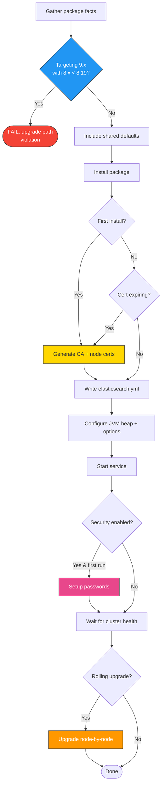

# elasticsearch

Ansible role for installing, configuring, and managing Elasticsearch. Handles cluster formation, TLS certificate management, security setup (users, passwords, HTTPS), rolling upgrades (8.x to 9.x), JVM tuning, and systemd service management.

In a full-stack deployment, this role should run second (after `repos`). It initializes the certificate authority, generates passwords for the `elastic` superuser, and creates the cluster that all other roles depend on. The first host in the `elasticsearch` inventory group becomes the CA host and the initial master-eligible node.

## Task flow



## Requirements

- Minimum Ansible version: `2.18`
- The `repos` role must run first to configure package repositories

## Default Variables

### Service Management

```yaml
elasticsearch_enable: true
elasticsearch_manage_yaml: true
elasticsearch_manage_logging: false
elasticsearch_config_backup: false
```

`elasticsearch_enable` controls whether the Elasticsearch systemd service is started and enabled at boot. Set to `false` to install and configure Elasticsearch without starting it, which is useful when orchestrating startup order manually across a large cluster.

`elasticsearch_manage_yaml` controls whether the role writes `elasticsearch.yml`. Set to `false` if you manage the configuration file through a separate template, a config management tool, or Elastic's enrollment API.

`elasticsearch_manage_logging` controls whether the role writes `log4j2.properties`. This is `false` by default, meaning Elasticsearch ships with its upstream logging config. Set to `true` to use the role's templated logging config, which gives you granular control over appenders (see [Logging Configuration](#logging-configuration) below).

`elasticsearch_config_backup` creates a timestamped backup of `elasticsearch.yml` (and `log4j2.properties` when managed) before each overwrite. Useful during initial tuning, but generates file clutter on long-running clusters. The backups live alongside the originals in `/etc/elasticsearch/`.

### Cluster Settings

```yaml
elasticsearch_clustername: elasticsearch
elasticsearch_ml_enabled: true
elasticsearch_api_host: localhost
elasticsearch_http_protocol: http
```

`elasticsearch_clustername` is the Elasticsearch cluster name. Every node that should join the same cluster must share this value. Change it from the default before deploying production clusters to avoid accidental cross-cluster joins on shared networks.

`elasticsearch_ml_enabled` toggles machine learning features (`xpack.ml.enabled`). Disable on dedicated data-only or coordinating-only nodes, or when ML is not licensed. ML nodes require additional memory overhead.

`elasticsearch_api_host` is the hostname or IP the role uses for API health checks during convergence. It polls `http(s)://<this>:9200/_cluster/health` to verify the node is ready before proceeding with security setup or rolling upgrades. Change this if Elasticsearch binds to a non-localhost address and localhost is not routable.

`elasticsearch_http_protocol` is the protocol for API calls. The role automatically overrides this to `https` when `elasticsearch_security` and `elasticsearch_http_security` are both enabled, so you rarely need to set it manually.

### Network

These variables are all optional and undefined by default. When unset, the template uses sensible defaults.

```yaml
# elasticsearch_network_host: ["_local_", "_site_"]   # default when unset
# elasticsearch_http_publish_host: 10.0.0.5            # for multi-homed hosts
# elasticsearch_http_publish_port: 9200                # rarely needed
# elasticsearch_transport_port: 9300                    # override transport port
# elasticsearch_nodename: "{{ ansible_facts.hostname }}" # auto-set from hostname
```

`elasticsearch_network_host` sets `network.host` in `elasticsearch.yml`. Accepts a string (`"_site_"`) or a list (`["_local_", "_site_"]`). When undefined, the template writes `["_local_", "_site_"]`, binding to both localhost and the site-local interface. For production clusters that need to be reachable from other hosts, set this to the node's routable address or a network interface specifier like `_eth0_`.

`elasticsearch_http_publish_host` and `elasticsearch_http_publish_port` set the address and port that Elasticsearch advertises to other nodes for HTTP communication. Use these on multi-homed hosts where the bind address differs from the address other nodes or clients should use.

`elasticsearch_transport_port` overrides the default transport port (9300). Only set this if you need non-standard port assignments.

`elasticsearch_nodename` defaults to `ansible_facts.hostname` if not set. Override it when hostnames are not unique across your inventory or when you want human-readable node names that differ from the OS hostname.

### Node Roles

```yaml
# elasticsearch_node_types: ["master", "data", "ingest"]  # undefined by default
```

`elasticsearch_node_types` sets `node.roles` in `elasticsearch.yml`. When undefined, Elasticsearch assigns all roles to the node (the default for small clusters). Define this to create dedicated node types in larger deployments. The role validates that the number of master-eligible nodes is odd to prevent split-brain scenarios -- an even master count fails the play immediately.

Common configurations:

```yaml
# Dedicated master
elasticsearch_node_types: ["master"]

# Dedicated data + ingest
elasticsearch_node_types: ["data", "ingest"]

# Coordinating-only
elasticsearch_node_types: []
```

### Discovery

```yaml
# elasticsearch_seed_hosts: ["10.0.0.1", "10.0.0.2", "10.0.0.3"]  # undefined by default
```

`elasticsearch_seed_hosts` overrides the auto-generated `discovery.seed_hosts`. By default the role builds this list from all hosts in the `elasticsearch` inventory group. Set it manually when your inventory hostnames don't resolve to the correct addresses, or when master-eligible nodes are a subset that you want to enumerate explicitly.

!!! note
    When the `elasticsearch` inventory group contains exactly one host, the template writes `discovery.type: single-node` and omits both `discovery.seed_hosts` and `cluster.initial_master_nodes`. No manual configuration is needed for single-node clusters.

### Paths and Storage

```yaml
elasticsearch_datapath: /var/lib/elasticsearch
elasticsearch_create_datapath: false
elasticsearch_logpath: /var/log/elasticsearch
elasticsearch_create_logpath: false
elasticsearch_conf_dir: /etc/elasticsearch/
elasticsearch_group: elasticsearch
```

`elasticsearch_datapath` is the filesystem path where Elasticsearch stores indices and shard data. Point this at your fastest storage (NVMe preferred). In production, use a dedicated volume so that disk pressure on the OS partition doesn't affect Elasticsearch.

`elasticsearch_create_datapath` creates the data directory if it doesn't exist. Enable this when using a non-default data path that isn't pre-created by the package or a mount point. The directory is created with owner `elasticsearch:elasticsearch` and mode `2750`.

`elasticsearch_logpath` is where Elasticsearch writes log files (server, deprecation, slowlog, GC, audit). The JVM error file (`hs_err_pid*.log`) and GC logs are also written here.

`elasticsearch_create_logpath` creates the log directory if it doesn't exist. Same ownership and permissions as the data directory.

`elasticsearch_conf_dir` is the configuration directory. You should almost never change this from the package default.

`elasticsearch_group` is the Linux group that owns Elasticsearch config and data files. Change this only if your organization's security policy requires a different group name.

### Snapshot Repository Paths

```yaml
# elasticsearch_fs_repo:         # undefined by default
#   - /mnt/backups/elasticsearch
#   - /mnt/nfs/snapshots
```

`elasticsearch_fs_repo` sets `path.repo` in `elasticsearch.yml`, which defines the allowed filesystem paths for snapshot repositories. Each path in the list becomes a permitted location for `fs` type snapshot repositories. This must be set identically on all nodes in the cluster, and the paths must be accessible (typically shared NFS or similar) from every node.

### JVM Configuration

```yaml
elasticsearch_heap: "{{ [[(ansible_facts.memtotal_mb // 1024) // 2, 30] | min, 1] | max }}"
elasticsearch_check_calculation: false
elasticsearch_heap_dump_path: "{{ '/var/log/elasticsearch' if (elasticstack_release | int >= 9) else '/var/lib/elasticsearch' }}"
elasticsearch_jvm_custom_parameters: ''
elasticsearch_pamlimits: true
elasticsearch_jna_workaround: false
elasticsearch_memory_lock: false
```

`elasticsearch_heap` is the JVM heap size in gigabytes. Both `-Xms` and `-Xmx` are set to this value (Elastic recommends equal initial and maximum heap). The default formula calculates half of system RAM, capped at 30 GB, with a floor of 1 GB. The 30 GB cap keeps the JVM within compressed ordinary object pointers (oops) territory. For production nodes, 8-16 GB is typical; the default of 2 GB (on a 4 GB host) is fine for development. Override with an integer: `elasticsearch_heap: 16`.

!!! tip
    Set `elasticsearch_check_calculation: true` to print the calculated heap value during a run without making any changes. Useful for verifying auto-calculation on heterogeneous hardware before committing.

`elasticsearch_heap_dump_path` is where the JVM writes heap dumps on `OutOfMemoryError`. Upstream changed the default from `/var/lib/elasticsearch` to `/var/log/elasticsearch` in 9.x, and the role follows that convention automatically based on `elasticstack_release`. Make sure this path has enough free space for a full heap dump (equal to `elasticsearch_heap` in size).

`elasticsearch_jvm_custom_parameters` appends additional JVM options to `jvm.options.d/90-custom.options`. Accepts a multi-line string or a list. Each line becomes a separate JVM flag. Use this for GC tuning, debug flags, system property overrides, or the entitlements workaround in containerized 9.x.

```yaml
# Multi-line string
elasticsearch_jvm_custom_parameters: |
  -XX:+HeapDumpOnOutOfMemoryError
  -Djava.io.tmpdir=/var/tmp/elasticsearch

# List form (also supported)
elasticsearch_jvm_custom_parameters:
  - -XX:+HeapDumpOnOutOfMemoryError
  - -Djava.io.tmpdir=/var/tmp/elasticsearch
```

`elasticsearch_pamlimits` sets `nofile=65535` (soft and hard) for the `elasticsearch` user via `/etc/security/limits.d/`. Required for production deployments. The RPM post-install scripts historically failed to set this reliably, so the role handles it directly.

`elasticsearch_jna_workaround` redirects JNA's temp directory from `/tmp` to `{{ elasticsearch_datapath }}/tmp` via the sysconfig file. Enable this on systems where `/tmp` is mounted with `noexec`, which prevents Java Native Access from loading native libraries.

`elasticsearch_memory_lock` sets `bootstrap.memory_lock: true` in `elasticsearch.yml` and creates a systemd override with `LimitMEMLOCK=infinity`. This prevents the OS from swapping Elasticsearch's heap to disk, which causes severe performance degradation. Recommended for production, but requires that the system has enough physical RAM to hold the heap without swapping.

### systemd Overrides

```yaml
elasticsearch_systemd_override_type_exec: false
```

`elasticsearch_systemd_override_type_exec` creates a systemd drop-in that changes the Elasticsearch service from `Type=notify` to `Type=exec`. Elasticsearch 8.19+ and 9.x use `Type=notify` with a `systemd-entrypoint` binary that sends `READY=1`. In container environments (Docker-in-Docker, some LXC setups), the sd_notify socket doesn't work -- systemd never receives the ready signal, waits 900 seconds, then kills the process even though Elasticsearch is fully operational. The role's own health-check retries handle readiness detection when this override is active.

### Persistent Cluster Settings

```yaml
elasticsearch_cluster_settings: {}
```

`elasticsearch_cluster_settings` applies persistent cluster settings via the `PUT _cluster/settings` API after the cluster is healthy. Unlike `elasticsearch_extra_config` (which writes to `elasticsearch.yml` and requires a restart), cluster settings take effect immediately at runtime and apply cluster-wide. The task reads current settings first and only sends the PUT when values differ.

```yaml
elasticsearch_cluster_settings:
  cluster.logsdb.enabled: true
  indices.recovery.max_bytes_per_sec: "100mb"
  cluster.routing.allocation.disk.watermark.low: "90%"
  cluster.routing.allocation.disk.watermark.high: "95%"
```

Any setting supported by the [cluster settings API](https://www.elastic.co/docs/reference/elasticsearch/rest-api/cluster/update-cluster-settings) can be used. Values can be strings, numbers, booleans, or nested objects — the YAML dict is serialized to JSON directly.

### LogsDB

```yaml
elasticsearch_logsdb: true   # default: true for 9.x, false for 8.x
```

`elasticsearch_logsdb` enables the LogsDB index mode for `logs-*-*` data streams by setting `cluster.logsdb.enabled: true` as a persistent cluster setting. LogsDB uses synthetic `_source` reconstruction and optimized doc_values compression for up to 4x storage savings with under 5% indexing overhead. Fresh 9.x installs enable this by default, but 8.x-to-9.x upgrades do not — this variable ensures consistent behavior. Requires ES 8.17+ (LogsDB GA). Existing backing indices remain in standard mode until ILM deletes them; new backing indices pick up LogsDB on their next rollover.

### Temperature Attribute

```yaml
# elasticstack_temperature: hot   # undefined by default, set in shared role
```

`elasticstack_temperature` is a shared variable (from the `elasticstack` role) that sets `node.attr.temp` in `elasticsearch.yml`. Use this with ILM or data tier routing to mark nodes as `hot`, `warm`, or `cold`. Only set on clusters using tiered storage.

### Security Enrollment

```yaml
# elasticsearch_security_enrollment: true   # undefined by default
```

`elasticsearch_security_enrollment` sets `xpack.security.enrollment.enabled` in `elasticsearch.yml`. This controls Elasticsearch's built-in enrollment API for adding new nodes and Kibana instances via enrollment tokens. Only takes effect when `elasticsearch_security` is also enabled.

### Security and TLS

```yaml
elasticsearch_security: true
elasticsearch_http_security: true
elasticsearch_bootstrap_pw: PleaseChangeMe
elasticsearch_elastic_password: ""
elasticsearch_ssl_verification_mode: full
elasticsearch_tls_key_passphrase: PleaseChangeMeIndividually
elasticsearch_validate_api_certs: false
```

!!! warning
    Both `elasticsearch_bootstrap_pw` and `elasticsearch_tls_key_passphrase` ship with placeholder defaults. Change them before deploying to any environment. The bootstrap password is only used once during initial security setup, but the TLS key passphrase protects every node's private key for the life of the cluster. Use Ansible Vault or a secrets manager.

`elasticsearch_elastic_password` sets a user-defined password for the `elastic` superuser. When set, the role changes the auto-generated password to this value after initial security setup and uses it for all subsequent API calls. Leave empty to keep using the auto-generated password from the `initial_passwords` file. The `initial_passwords` file is preserved for other built-in users (kibana_system, beats_system, etc.).

`elasticsearch_security` is the main security toggle. When enabled, the role generates a certificate authority, creates per-node TLS certificates, configures transport and HTTP encryption, initializes the `elastic` superuser password, and enables RBAC. Elasticsearch 8.x and later require security -- the role fails the play if you try to disable it on 8.x+.

`elasticsearch_http_security` controls TLS on the HTTP interface (port 9200) independently of transport encryption. Only relevant when `elasticsearch_security` is also `true`. Disabling HTTP security while keeping transport encryption is unusual but sometimes done behind a TLS-terminating reverse proxy.

`elasticsearch_ssl_verification_mode` sets the TLS verification mode for inter-node transport communication. `full` verifies both the certificate chain and the hostname (recommended). `certificate` verifies only the chain (use when node hostnames don't match certificate SANs). `none` disables verification entirely (not recommended, even for testing).

`elasticsearch_validate_api_certs` controls whether the role validates TLS certificates when it makes API calls to Elasticsearch during convergence (health checks, password setup, rolling upgrades). Default `false` because the role's auto-generated CA is not in the system trust store. Set to `true` when using certificates from a CA that the managed nodes already trust.

`elasticsearch_initialized_file` is a marker file that the role creates after successful cluster initialization. On subsequent runs, the role checks for this file to skip security setup. The default path is alongside the passwords file.

```yaml
elasticsearch_initialized_file: "{{ elasticstack_initial_passwords | dirname }}/cluster_initialized"
```

### Custom TLS Certificates

```yaml
elasticsearch_cert_source: elasticsearch_ca
```

`elasticsearch_cert_source` selects where TLS certificates come from. `elasticsearch_ca` (the default) uses Elasticsearch's built-in `certutil` to auto-generate a CA and per-node certificates. `external` means you provide your own certificates from any CA.

#### External certificate file paths

These variables are only used when `elasticsearch_cert_source: external`.

```yaml
elasticsearch_transport_tls_certificate: ""
elasticsearch_transport_tls_key: ""
elasticsearch_transport_tls_key_passphrase: ""
elasticsearch_http_tls_certificate: ""
elasticsearch_http_tls_key: ""
elasticsearch_http_tls_key_passphrase: ""
elasticsearch_tls_ca_certificate: ""
elasticsearch_tls_remote_src: false
elasticsearch_http_ssl_keystore_path: ""
```

`elasticsearch_transport_tls_certificate` is the path to the transport layer (port 9300) TLS certificate. Accepts PEM (`.crt`, `.pem`) or PKCS12 (`.p12`, `.pfx`) -- the format is auto-detected from the file extension.

`elasticsearch_transport_tls_key` is the transport private key. For PEM format, this is auto-derived from the certificate path (`.crt` replaced with `.key`) if left empty. Ignored for P12 bundles where the key is included in the keystore.

`elasticsearch_transport_tls_key_passphrase` is the passphrase for an encrypted transport key or P12 file. Leave empty for unencrypted keys.

`elasticsearch_http_tls_certificate`, `elasticsearch_http_tls_key`, and `elasticsearch_http_tls_key_passphrase` are the HTTP layer equivalents. When empty, they fall back to the transport certificate, key, and passphrase respectively. Set them separately only when you use different certificates for transport and HTTP (e.g., different SANs).

`elasticsearch_tls_ca_certificate` is the CA certificate path. If empty and the PEM certificate file contains a chain (multiple certificate blocks), the CA is auto-extracted from the chain.

`elasticsearch_tls_remote_src` controls where certificate files are read from. `false` (default) means files are on the Ansible controller and will be copied to the managed node. `true` means files are already present on the managed node.

`elasticsearch_http_ssl_keystore_path` overrides the HTTP SSL keystore path written to `elasticsearch.yml`. When empty, the role uses its default path under `certs/`. Use this when you need to point to a keystore at a non-standard location.

#### Inline PEM content variables

An alternative to file paths -- pass PEM certificate content directly as Ansible variables. Content variables take precedence over file paths. Only PEM format is supported (PKCS12 is binary and not suitable for YAML). Useful for per-host certificates stored in Vault-encrypted `host_vars`.

```yaml
elasticsearch_transport_tls_certificate_content: ""
elasticsearch_transport_tls_key_content: ""
elasticsearch_http_tls_certificate_content: ""   # falls back to transport
elasticsearch_http_tls_key_content: ""            # falls back to transport
elasticsearch_tls_ca_certificate_content: ""
```

### Certificate Lifecycle

```yaml
elasticsearch_cert_validity_period: 1095
elasticsearch_cert_expiration_buffer: 30
elasticsearch_cert_will_expire_soon: false
```

`elasticsearch_cert_validity_period` is the validity period in days for auto-generated node TLS certificates. Default is 1095 days (3 years). Shorter periods improve security posture but require more frequent renewals. The CA certificate validity is separate and controlled by the shared `elasticstack` role.

`elasticsearch_cert_expiration_buffer` is the number of days before certificate expiry at which the role triggers automatic renewal. At 30 days (default), the role regenerates certificates during any playbook run that happens within 30 days of expiry. Set this higher than your longest expected gap between playbook runs.

!!! tip
    Elasticsearch automatically reloads SSL certificates from disk, so certificate renewal does not require an Elasticsearch restart. Kibana (Node.js) does need a restart to pick up new certificates, and the role handles this automatically. You can trigger immediate renewal with `--tags renew_es_cert`.

`elasticsearch_cert_will_expire_soon` is an internal flag set by the role during execution. Do not set this manually.

### Logging Configuration

These variables control the `log4j2.properties` template. They only take effect when `elasticsearch_manage_logging: true`.

```yaml
elasticsearch_logging_console: false
elasticsearch_logging_file: true
elasticsearch_logging_json_file: true
elasticsearch_logging_slowlog: true
elasticsearch_logging_deprecation: true
elasticsearch_logging_audit: true
```

`elasticsearch_logging_console` enables the console (stdout) log appender. Usually off for daemon mode; enable it when running Elasticsearch in the foreground for debugging.

`elasticsearch_logging_file` enables the plain-text rolling file appender that writes `<clustername>.log`. This is the traditional human-readable log format. Rotates daily and by size (256 MB), keeping 7 files.

`elasticsearch_logging_json_file` enables the JSON rolling file appender that writes `<clustername>_server.json`. This is the default structured format since ES 8.x, suitable for ingestion into a monitoring cluster or log aggregator. Uses `ECSJsonLayout` on 9.x and `ESJsonLayout` on 8.x.

`elasticsearch_logging_slowlog` enables both search and indexing slow log appenders. Slow logs capture queries and indexing operations that exceed configurable thresholds (set via cluster settings API, not this role). The appenders write to `<clustername>_index_search_slowlog.json` and `<clustername>_index_indexing_slowlog.json`.

`elasticsearch_logging_deprecation` enables the deprecation log appender, writing to `<clustername>_deprecation.json`. Essential before major version upgrades to identify deprecated API usage. On 9.x, this also enables the `HeaderWarningAppender` that returns deprecation warnings in HTTP response headers.

`elasticsearch_logging_audit` enables the security audit log appender, writing to `<clustername>_audit.json`. Only meaningful when `elasticsearch_security` is also true. Records authentication events, access grants/denials, and security configuration changes. Required for compliance in many environments.

=== "8.x"

    JSON logs use `ESJsonLayout` with `type_name` fields. Deprecation logs include `esmessagefields: x-opaque-id` for request correlation. Indexing slow log logger name is `index.indexing.slowlog`.

=== "9.x"

    JSON logs use `ECSJsonLayout` with `dataset` fields (Elastic Common Schema). Deprecation logs add a `RateLimitingFilter` to prevent log flooding and a `HeaderWarningAppender` for HTTP response warnings. Indexing slow log logger name changed to `index.indexing.slowlog.index`.

### Extra Configuration

```yaml
elasticsearch_extra_config:
  action.destructive_requires_name: true
  indices.recovery.max_bytes_per_sec: "100mb"
  http.cors.enabled: true
  http.cors.allow-origin: "https://dashboard.example.com"
  thread_pool.search.size: 30
```

`elasticsearch_extra_config` is a dictionary of arbitrary `elasticsearch.yml` settings. Any valid Elasticsearch configuration key can go here — CORS, recovery throttling, destructive action guards, thread pool tuning, monitoring, plugin settings, etc. The template renders these as top-level YAML keys.

Keys that conflict with settings managed by dedicated role variables (like `cluster.name`, `network.host`, security/TLS settings, `bootstrap.memory_lock`) are silently filtered out, and the role emits a warning telling you to use the dedicated variable instead.

### Rolling Upgrades

The role validates the upgrade path before any work begins. When `elasticstack_release` is 9 or higher and Elasticsearch is currently installed, the role checks that the installed version is at least 8.19.0. If it finds an older 8.x version, the play fails immediately -- you must step through 8.19.x first. This matches [Elastic's official upgrade requirements](https://www.elastic.co/docs/deploy-manage/upgrade/deployment-or-cluster).

```yaml
elasticsearch_unsafe_upgrade_restart: false
```

`elasticsearch_unsafe_upgrade_restart` skips rolling upgrade safety checks (shard allocation disable, synced flush, green health wait) and restarts all nodes simultaneously. This loses data availability during the upgrade window. Only use in non-production environments where you trade safety for speed.

### Internal Variables

These are used internally by the role. Do not set them in your inventory.

```yaml
elasticsearch_freshstart:
  changed: false

elasticsearch_freshstart_security:
  changed: false
```

`elasticsearch_freshstart` tracks whether this run performed a fresh installation (the Elasticsearch package was just installed for the first time). The handler uses this to suppress redundant restarts after initial install.

`elasticsearch_freshstart_security` tracks whether security was just initialized on this run. Same purpose as above -- prevents a handler restart when the security setup task already started the service.

## Operational notes

### Master node quorum

The role validates that you have an odd number of master-eligible nodes. An even number makes split-brain possible. If you define `elasticsearch_node_types` and the resulting master count is even, the play fails with an error.

### Heap auto-calculation

The default heap formula is `min(max(memtotal_mb / 1024 / 2, 1), 30)` -- half of system RAM in GB, floored at 1 GB, capped at 30 GB. The 30 GB cap follows Elastic's recommendation to stay below the compressed ordinary object pointers (oops) threshold. In containers with a cgroup memory limit lower than the host's physical RAM, the role recalculates heap from the cgroup limit instead of `memtotal_mb`. This prevents containers from allocating heap based on host RAM (e.g. 30 GB heap in a 4 GB container). The recalculation only applies when `elasticsearch_heap` has not been explicitly overridden. Set `elasticsearch_check_calculation: true` to print the calculated value during a run without making changes.

### PAM limits

The role sets `nofile=65535` for the `elasticsearch` user via PAM (`/etc/security/limits.d/`). This is required for production but was historically unreliable in the RPM post-install scripts. Controlled by `elasticsearch_pamlimits` (default `true`).

### JNA tmpdir workaround

On systems where `/tmp` is mounted with `noexec`, Java Native Access fails to load native libraries. Set `elasticsearch_jna_workaround: true` to redirect JNA's temp directory to `{{ elasticsearch_datapath }}/tmp` via the sysconfig file (`/etc/default/elasticsearch` on Debian, `/etc/sysconfig/elasticsearch` on RedHat).

### systemd sd_notify workaround

Elasticsearch 8.19+ and 9.x use `Type=notify` in their systemd unit, relying on a `systemd-entrypoint` binary to send `READY=1`. In container environments (Docker-in-Docker, some LXC setups), the sd_notify socket doesn't work -- systemd never receives the ready signal, waits 900 seconds, then kills Elasticsearch even though it's fully operational.

The role detects container environments (`virtualization_type` in `container`, `docker`) and drops in a systemd override that changes `Type=exec`, bypassing sd_notify entirely. The role's own health-check retries handle readiness detection instead.

### Keystore management

The role manages the Elasticsearch keystore (`/etc/elasticsearch/elasticsearch.keystore`) for TLS certificate passphrases:

- Removes the `autoconfiguration.password_hash` key that ES 8.x writes during package install (it conflicts with the role's bootstrap password)
- Sets `bootstrap.password` for initial security setup
- Sets `xpack.security.http.ssl.keystore.secure_password` and `truststore.secure_password` (when HTTP security enabled)
- Sets `xpack.security.transport.ssl.keystore.secure_password` and `truststore.secure_password` (when transport security enabled)

Each key is only written if its value has changed, and removed if the corresponding security feature is disabled.

### Security initialization retries

The security setup includes multiple retry loops to handle the window between Elasticsearch starting and the security subsystem being fully ready:

| Check | Retries | Delay | Total wait |
|-------|---------|-------|------------|
| Bootstrap API responsiveness | 5 | 10s | ~50s |
| Bootstrap cluster health | 5 | 10s | ~50s |
| Elastic password API check | 20 | 10s | ~200s |
| Post-watermark cluster health | 20 | 10s | ~200s |
| Wait for port (per node) | -- | -- | 600s timeout |

### Container disk watermarks

In container environments (`virtualization_type` in `container`, `docker`, `lxc`), the role sets ultra-lenient disk watermarks (low: 97%, high: 98%, flood: 99%) to prevent Elasticsearch from refusing to allocate shards due to limited disk space. This is set both during security initialization and during rolling upgrades. The role also runs `rm -rf /var/cache/*` to free disk space in containers.

### Handler guards

The "Restart Elasticsearch" handler has four guards that prevent it from firing when a restart would be redundant or harmful:

1. `elasticsearch_enable` must be true
2. NOT during a fresh install (service already started naturally)
3. NOT during security initialization (service already started)
4. NOT after a rolling upgrade (upgrade did its own restart)

The handler also triggers a Kibana restart on all Kibana hosts (if `elasticstack_full_stack` is enabled) since Kibana may need to reconnect after an ES restart. This Kibana restart is skipped during CA renewal.

### Double config write

The role writes `elasticsearch.yml` and JVM options twice: once before the rolling upgrade (so the upgrade restart picks up new config in a single restart instead of requiring a second restart afterward), and once after all security initialization is complete (when all facts like `elasticsearch_cluster_set_up` are known). This prevents a double-restart that would otherwise occur during upgrades.

### Single-node discovery

When the `elasticsearch` inventory group contains exactly one host, the template writes `discovery.type: single-node` and omits `discovery.seed_hosts` and `cluster.initial_master_nodes`. This avoids bootstrap issues on single-node clusters.

### Network binding

By default, Elasticsearch binds to `["_local_", "_site_"]` (localhost and the site-local interface). Override with `elasticsearch_network_host` for custom binding. The template also supports `http.publish_host` and `http.publish_port` for multi-homed hosts.

### Password file format

The initial passwords file at `/usr/share/elasticsearch/initial_passwords` is generated by `elasticsearch-setup-passwords auto -b`. The role parses it with `grep "PASSWORD <username> " | awk '{print $4}'`. Other roles (Kibana, Logstash, Beats) delegate to the CA host to read their service passwords from this file.

### ES 8+ security requirement

The role enforces that `elasticsearch_security` must be `true` for Elasticsearch 8.x and later. Running ES 8+ without security is not supported by Elastic and the role will fail the play if you try.

## Tags

| Tag | Purpose |
|-----|---------|
| `certificates` | Run all certificate-related tasks |
| `renew_ca` | Renew the certificate authority (triggers renewal of all dependent certs) |
| `renew_es_cert` | Renew only Elasticsearch node certificates |

## License

GPL-3.0-or-later

## Author

Netways GmbH
