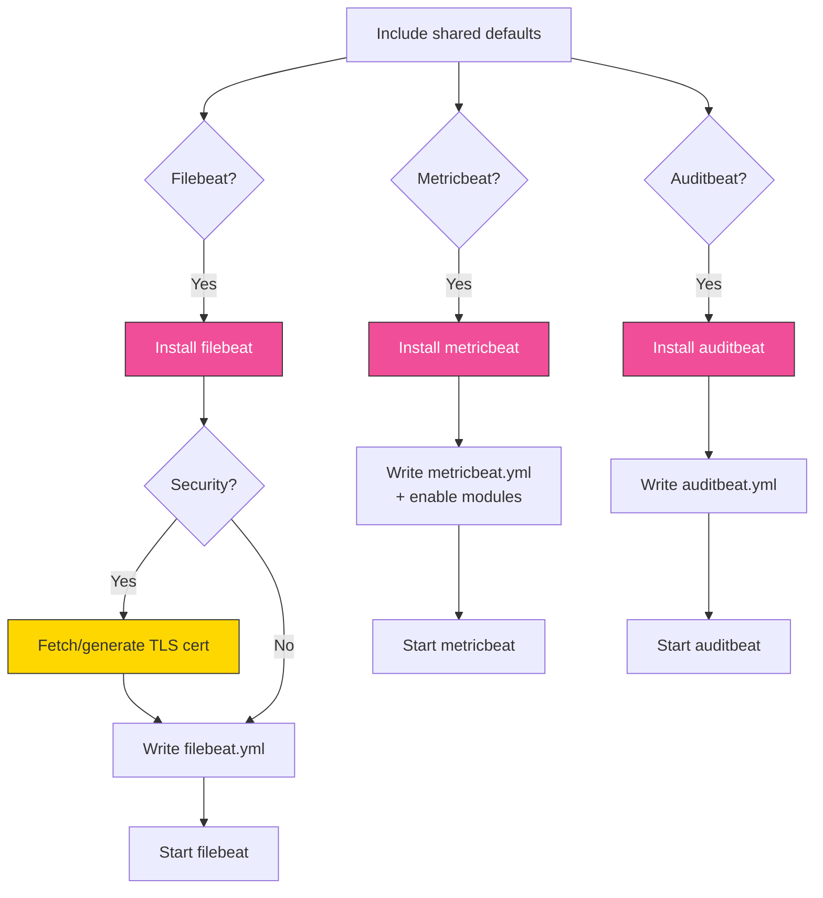
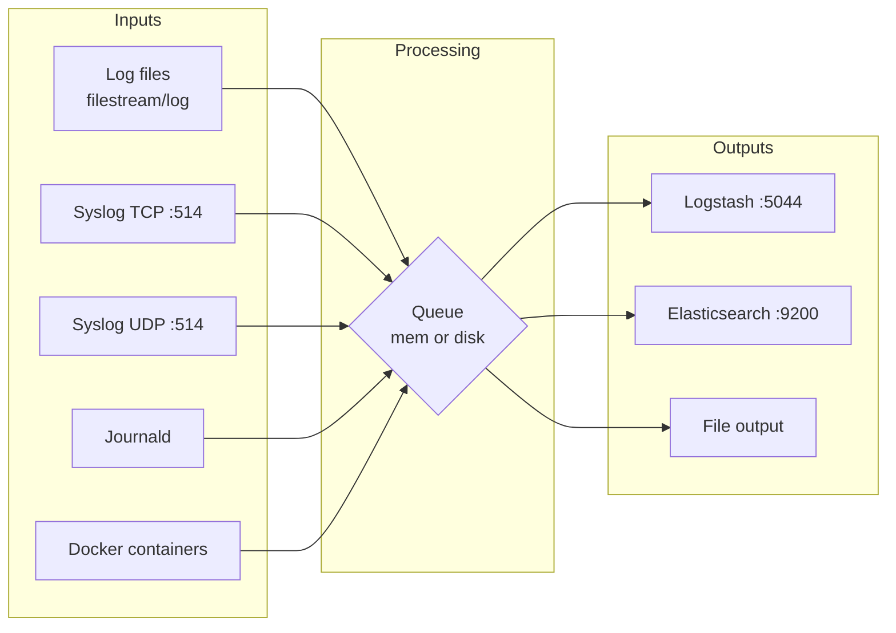

# beats

Ansible role for installing, configuring, and managing Elastic Beats (Filebeat, Metricbeat, Auditbeat). Handles syslog inputs (TCP/UDP), log file inputs with multiline support, journald inputs, Docker container logs, TLS certificate management, and output to Elasticsearch or Logstash.

The role installs whichever Beat types are enabled (`beats_filebeat`, `beats_metricbeat`, `beats_auditbeat`) and configures each with its own YAML template. All three Beats share common settings for logging, TLS, and target hosts, while each has its own output destination and module configuration.

## Task flow



## Requirements

- Minimum Ansible version: `2.18`
- In a full-stack deployment, Elasticsearch (and optionally Logstash) should be running before applying this role

## Default Variables

### General Settings

#### beats_security

Enable TLS security for Beats communication with Elasticsearch or Logstash. When `true`, each Beat uses client certificates to authenticate.

```yaml
beats_security: false  # default
```

#### beats_filebeat

Install and configure Filebeat.

```yaml
beats_filebeat: true  # default
```

#### beats_auditbeat

Install and configure Auditbeat.

```yaml
beats_auditbeat: false  # default
```

#### beats_metricbeat

Install and configure Metricbeat.

```yaml
beats_metricbeat: false  # default
```

#### beats_target_hosts

List of Elasticsearch or Logstash hosts to send data to. Only used when `elasticstack_full_stack: false` — in full-stack mode, hosts are auto-discovered from inventory groups.

```yaml
beats_target_hosts:  # default
  - localhost
```

### Logging

These settings apply to all three Beat types (Filebeat, Metricbeat, Auditbeat).

#### beats_logging

Logging destination. Set to `file` for file-based logging.

```yaml
beats_logging: file  # default
```

#### beats_logpath

Directory for Beat log files.

```yaml
beats_logpath: /var/log/beats  # default
```

#### beats_loglevel

Log level for all Beats. Valid values: `debug`, `info`, `warning`, `error`, `critical`.

```yaml
beats_loglevel: info  # default
```

#### beats_logging_keepfiles

Number of rotated log files to retain.

```yaml
beats_logging_keepfiles: 7  # default
```

#### beats_logging_permissions

File permissions for Beat log files.

```yaml
beats_logging_permissions: "0644"  # default
```

### TLS Certificates

#### beats_tls_key

Path to the Beat TLS private key file.

```yaml
beats_tls_key: "{{ beats_ca_dir }}/{{ inventory_hostname }}-beats.key"  # default
```

#### beats_tls_cert

Path to the Beat TLS certificate file.

```yaml
beats_tls_cert: "{{ beats_ca_dir }}/{{ inventory_hostname }}-beats.crt"  # default
```

#### beats_tls_cacert

Path to the CA certificate for TLS verification.

```yaml
beats_tls_cacert: "{{ beats_ca_dir }}/ca.crt"  # default
```

#### beats_tls_key_passphrase

Passphrase for the Beat TLS private key.

```yaml
beats_tls_key_passphrase: BeatsChangeMe  # default
```

### Filebeat Configuration

Filebeat supports multiple input types that can be enabled simultaneously. Each input feeds into a configurable output (Logstash or Elasticsearch), with an optional disk-backed queue for reliability:



#### beats_filebeat_enable

Enable the Filebeat service after installation.

```yaml
beats_filebeat_enable: true  # default
```

#### beats_filebeat_output

Output destination for Filebeat: `logstash` or `elasticsearch`.

```yaml
beats_filebeat_output: logstash  # default
```

#### beats_filebeat_loadbalance

Load balance events across multiple Logstash hosts when the output is `logstash`.

```yaml
beats_filebeat_loadbalance: true  # default
```

#### beats_filebeat_elastic_monitoring

Enable Elastic monitoring (X-Pack) metrics for Filebeat itself.

```yaml
beats_filebeat_elastic_monitoring: false  # default
```

### Filebeat Log Inputs

#### beats_filebeat_log_input

Enable file-based log inputs.

```yaml
beats_filebeat_log_input: true  # default
```

#### beats_filebeat_log_inputs

Dictionary of log inputs. Each key defines an input with paths, optional per-input fields, and optional multiline settings. On Elastic 9.x, inputs use the `filestream` type automatically; on 8.x they use the legacy `log` type.

```yaml
# default
beats_filebeat_log_inputs:
  messages:
    name: messages
    paths:
      - /var/log/messages
      - /var/log/syslog
```

Example with custom fields and multiline:

```yaml
beats_filebeat_log_inputs:
  syslog:
    name: syslog
    paths:
      - /var/log/syslog
  nginx:
    name: nginx
    paths:
      - /var/log/nginx/access.log
    fields:
      app: nginx
      logtype: access
  java:
    name: java-app
    paths:
      - /var/log/myapp/*.log
    multiline:
      type: pattern
      pattern: '^[[:space:]]+(at|\.{3})[[:space:]]+\b|^Caused by:'
      negate: false
      match: after
```

#### beats_filebeat_mysql_slowlog_input

Enable the MySQL slow query log input with built-in multiline parsing.

```yaml
beats_filebeat_mysql_slowlog_input: false  # default
```

#### beats_filebeat_modules

List of Filebeat modules to enable (e.g. `system`, `nginx`, `apache`).

```yaml
# default: none (commented out)
beats_filebeat_modules:
  - system
```

### Filebeat Syslog Inputs

#### beats_filebeat_syslog_tcp / beats_filebeat_syslog_tcp_port

Enable a TCP syslog listener and set its port. Network devices and applications can send syslog messages to Filebeat over TCP.

```yaml
beats_filebeat_syslog_tcp: false       # default
beats_filebeat_syslog_tcp_port: 514    # default
```

#### beats_filebeat_syslog_tcp_ssl

Enable TLS on the TCP syslog input.

```yaml
beats_filebeat_syslog_tcp_ssl: false  # default
```

#### beats_filebeat_syslog_tcp_fields

Custom fields added to every event from the TCP syslog input. These are merged with `beats_fields` (the global fields list). Use this to tag TCP syslog events so you can distinguish them from other inputs in your pipeline.

```yaml
beats_filebeat_syslog_tcp_fields: {}  # default
```

Example:

```yaml
beats_filebeat_syslog_tcp_fields:
  source_protocol: tcp
  environment: production
```

#### beats_filebeat_syslog_udp / beats_filebeat_syslog_udp_port

Enable a UDP syslog listener and set its port.

```yaml
beats_filebeat_syslog_udp: false       # default
beats_filebeat_syslog_udp_port: 514    # default
```

#### beats_filebeat_syslog_udp_fields

Custom fields added to every event from the UDP syslog input, same as the TCP variant.

```yaml
beats_filebeat_syslog_udp_fields: {}  # default
```

Example:

```yaml
beats_filebeat_syslog_udp_fields:
  source_protocol: udp
  environment: production
```

### Filebeat Journald Input

#### beats_filebeat_journald

Enable the journald input to read from the systemd journal.

```yaml
beats_filebeat_journald: false  # default
```

#### beats_filebeat_journald_inputs

Dictionary of journald inputs. Each key defines an input with an `id` and optional `include_matches` filter to limit which journal entries are collected.

```yaml
# default
beats_filebeat_journald_inputs:
  everything:
    id: everything
```

Example — filter to specific systemd units:

```yaml
beats_filebeat_journald_inputs:
  everything:
    id: everything
  vault:
    id: service-vault
    include_matches:
      - _SYSTEMD_UNIT=vault.service
```

### Filebeat Docker Input

#### beats_filebeat_docker

Enable Docker container log collection.

```yaml
beats_filebeat_docker: false  # default
```

#### beats_filebeat_docker_ids

Docker container IDs to collect logs from. Use `*` for all containers.

```yaml
beats_filebeat_docker_ids: "*"  # default
```

### Filebeat Queue

#### beats_queue_type

Filebeat internal queue type. Use `mem` for in-memory (default, fastest, data lost on restart) or `disk` for a disk-backed queue (slower, survives restarts).

```yaml
beats_queue_type: mem  # default
```

#### beats_queue_disk_path

Custom filesystem path for the disk queue. Leave empty to use Filebeat's default data directory.

```yaml
beats_queue_disk_path: ""  # default
```

#### beats_queue_disk_max_size

Maximum size of the disk queue before Filebeat applies backpressure to inputs.

```yaml
beats_queue_disk_max_size: 1GB  # default
```

### Auditbeat Configuration

#### beats_auditbeat_enable

Enable the Auditbeat service. Set to `false` in containers or environments where the `auditd` kernel module is not available.

```yaml
beats_auditbeat_enable: true  # default
```

#### beats_auditbeat_setup

Run Auditbeat setup on first install (load dashboards, index templates into Elasticsearch).

```yaml
beats_auditbeat_setup: true  # default
```

#### beats_auditbeat_output

Output destination for Auditbeat: `elasticsearch` or `logstash`.

```yaml
beats_auditbeat_output: elasticsearch  # default
```

#### beats_auditbeat_loadbalance

Load balance events across multiple output hosts.

```yaml
beats_auditbeat_loadbalance: true  # default
```

### Metricbeat Configuration

#### beats_metricbeat_enable

Enable the Metricbeat service after installation.

```yaml
beats_metricbeat_enable: true  # default
```

#### beats_metricbeat_output

Output destination for Metricbeat: `elasticsearch` or `logstash`.

```yaml
beats_metricbeat_output: elasticsearch  # default
```

#### beats_metricbeat_modules

List of Metricbeat modules to enable.

```yaml
beats_metricbeat_modules:  # default
  - system
```

Example:

```yaml
beats_metricbeat_modules:
  - system
  - docker
```

#### beats_metricbeat_loadbalance

Load balance events across multiple output hosts.

```yaml
beats_metricbeat_loadbalance: true  # default
```

### Certificate Lifecycle

#### beats_cert_validity_period

Validity period in days for generated Beat TLS certificates.

```yaml
beats_cert_validity_period: 1095  # default
```

#### beats_cert_expiration_buffer

Days before certificate expiry to trigger renewal.

```yaml
beats_cert_expiration_buffer: 30  # default
```

#### beats_cert_will_expire_soon

Internal flag. Do not set manually.

```yaml
beats_cert_will_expire_soon: false  # default
```

## Operational notes

### Filestream vs log input type

On Elastic 9.x (`elasticstack_release >= 9`), Filebeat log inputs use the `filestream` type, which requires a unique `id` per input. On 8.x, inputs use the legacy `log` type (no ID needed). The template switches automatically based on the release version. Multiline syntax also differs:

- **9.x**: multiline settings go under a `parsers:` block
- **8.x**: multiline settings are at the input root level

You don't need to handle this yourself — the template generates the correct syntax based on `elasticstack_release`.

### Auditbeat and Metricbeat setup commands

Both Auditbeat and Metricbeat have a `setup` step that loads index templates, dashboards, and ingest pipelines into Elasticsearch. These setup tasks are gated on two conditions:

1. The setup flag is enabled (`beats_auditbeat_setup: true` / `beats_metricbeat_modules is defined`)
2. The output is set to `elasticsearch` (not `logstash`)

If you're outputting to Logstash, the setup commands are skipped because they need a direct Elasticsearch connection. You'd need to run setup separately or point a temporary Beat instance at ES.

### Metricbeat module management

Metricbeat modules are enabled via the CLI command `metricbeat modules enable <module>`, not via configuration file. The role uses a `creates:` guard based on the expected file path (`/etc/metricbeat/modules.d/<module>.yml`) to make this idempotent.

### SSL verification modes differ by output

When `beats_security` is enabled, the TLS `verification_mode` differs depending on the output target:

- **Elasticsearch output**: `verification_mode: none` — because Beats may connect to ES on localhost or via IP, where hostname verification would fail
- **Logstash output**: `verification_mode: full` — full certificate and hostname verification

### Security inheritance from full-stack mode

In full-stack mode (`elasticstack_full_stack: true`), `beats_security` is automatically set to `true` when `elasticstack_security` is `true`. You can override this with `elasticstack_override_beats_tls: true` to prevent the automatic TLS inheritance.

### Handler double guard

Each Beat's restart handler requires both the install flag AND the enable flag to fire:

- Filebeat: `beats_filebeat | bool` AND `beats_filebeat_enable | bool`
- Auditbeat: `beats_auditbeat | bool` AND `beats_auditbeat_enable | bool`
- Metricbeat: `beats_metricbeat | bool` AND `beats_metricbeat_enable | bool`

This prevents restart attempts on Beats that are installed but intentionally disabled (e.g. Auditbeat in containers where the audit kernel module isn't available).

### Auditbeat default modules

The Auditbeat template configures four modules by default (not configurable via variables):

- **auditd** — Linux audit framework, loads rules from `${path.config}/audit.rules.d/*.conf`
- **file_integrity** — Monitors `/bin`, `/usr/bin`, `/sbin`, `/usr/sbin`, `/etc` recursively
- **system (packages)** — Inventories installed packages every 2 minutes
- **system (state)** — Captures host, login, process, socket, and user state every 12 hours, with `user.detect_password_changes: true`

### Filebeat processors

The Filebeat template always includes `add_host_metadata` and `add_cloud_metadata` processors. When the Docker input is enabled, `add_docker_metadata` is also added.

### MySQL slow query log

The `beats_filebeat_mysql_slowlog_input` enables a dedicated input for `/var/log/mysql/*-slow.log` with built-in multiline parsing (pattern: `^#[[:space:]]Time`). It adds custom fields `mysql.logtype: slowquery` with `fields_under_root: true` so the field appears at the document root.

### TCP/UDP syslog max message size

Both the TCP and UDP syslog inputs set `max_message_size: 10MiB`. This is hardcoded in the template, not configurable via a variable.

### Container cache cleanup

Like other roles, Beats runs `rm -rf /var/cache/*` in container environments to free disk space for Elasticsearch replica allocation.

## Tags

| Tag | Purpose |
|-----|---------|
| `beats_configuration` | All Beats configuration tasks |
| `beats_filebeat_configuration` | Filebeat-specific configuration |
| `beats_metricbeat_configuration` | Metricbeat-specific configuration |
| `beats_auditbeat_configuration` | Auditbeat-specific configuration |
| `certificates` | Run all certificate-related tasks |
| `configuration` | General configuration tasks |
| `renew_beats_cert` | Renew Beat certificates |
| `renew_ca` | Renew the certificate authority |

## License

GPL-3.0-or-later

## Author

Thomas Widhalm, Netways GmbH
