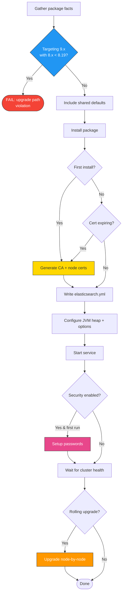

# elasticsearch

Ansible role for installing, configuring, and managing Elasticsearch. Handles cluster formation, TLS certificate management, security setup (users, passwords, HTTPS), rolling upgrades (8.x to 9.x), JVM tuning, and systemd service management.

In a full-stack deployment, this role should run second (after `repos`). It initializes the certificate authority, generates passwords for the `elastic` superuser, and creates the cluster that all other roles depend on. The first host in the `elasticsearch` inventory group becomes the CA host and the initial master-eligible node.

## Task flow



## Requirements

- Minimum Ansible version: `2.18`
- The `repos` role must run first to configure package repositories

## Default Variables

### Service Management

#### elasticsearch_enable

Whether to enable and start the Elasticsearch service.

```yaml
elasticsearch_enable: true  # default
```

#### elasticsearch_manage_yaml

Let the role manage `elasticsearch.yml`. Set to `false` if you manage the configuration file externally (e.g. through a separate template or config management tool).

```yaml
elasticsearch_manage_yaml: true  # default
```

#### elasticsearch_config_backup

Create a timestamped backup of `elasticsearch.yml` before overwriting it.

```yaml
elasticsearch_config_backup: false  # default
```

### Cluster Configuration

#### elasticsearch_clustername

Name of the Elasticsearch cluster. All nodes with the same cluster name will join the same cluster.

```yaml
elasticsearch_clustername: elasticsearch  # default
```

#### elasticsearch_ml_enabled

Enable machine learning features on this node. Set to `false` on dedicated data-only or coordinating-only nodes, or if ML is not licensed.

```yaml
elasticsearch_ml_enabled: true  # default
```

#### elasticsearch_api_host

Hostname or IP used for Elasticsearch API health checks during convergence. The role polls this address to verify the node is up before proceeding.

```yaml
elasticsearch_api_host: localhost  # default
```

#### elasticsearch_http_protocol

Protocol for Elasticsearch HTTP API. The role automatically overrides this to `https` when security is enabled, so you typically don't set this manually.

```yaml
elasticsearch_http_protocol: http  # default
```

### Paths and Storage

#### elasticsearch_datapath

Filesystem path for Elasticsearch data storage (indices, shards).

```yaml
elasticsearch_datapath: /var/lib/elasticsearch  # default
```

#### elasticsearch_create_datapath

Create the data directory if it does not exist. Enable this when using a non-default data path that might not be pre-created by the package.

```yaml
elasticsearch_create_datapath: false  # default
```

#### elasticsearch_logpath

Filesystem path for Elasticsearch log files.

```yaml
elasticsearch_logpath: /var/log/elasticsearch  # default
```

#### elasticsearch_create_logpath

Create the log directory if it does not exist.

```yaml
elasticsearch_create_logpath: false  # default
```

#### elasticsearch_conf_dir

Path to the Elasticsearch configuration directory.

```yaml
elasticsearch_conf_dir: /etc/elasticsearch/  # default
```

#### elasticsearch_group

Linux group that owns Elasticsearch files.

```yaml
elasticsearch_group: elasticsearch  # default
```

### JVM Configuration

#### elasticsearch_heap

JVM heap size in GB. Auto-calculated as half of system RAM, capped at 30 GB, with a minimum of 1 GB. Override this to set an explicit value (e.g. `"4"` for 4 GB).

```yaml
# default: auto-calculated
elasticsearch_heap: "{{ [[(ansible_facts.memtotal_mb // 1024) // 2, 30] | min, 1] | max }}"

# explicit override
elasticsearch_heap: 16
```

#### elasticsearch_check_calculation

Enable heap calculation verification — prints the calculated heap value during the run for debugging.

```yaml
elasticsearch_check_calculation: false  # default
```

#### elasticsearch_heap_dump_path

Directory for JVM heap dump files on OutOfMemoryError.

```yaml
elasticsearch_heap_dump_path: /var/lib/elasticsearch  # default
```

#### elasticsearch_jvm_custom_parameters

Additional JVM parameters appended to `jvm.options.d/`. Use for GC tuning, debug flags, or system property overrides. Each line becomes a separate JVM option.

```yaml
elasticsearch_jvm_custom_parameters: ''  # default
```

Example:

```yaml
elasticsearch_jvm_custom_parameters: |
  -XX:+HeapDumpOnOutOfMemoryError
  -Djava.io.tmpdir=/var/tmp/elasticsearch
```

#### elasticsearch_pamlimits

Configure PAM limits for the `elasticsearch` user (open files, max processes). Required for production deployments.

```yaml
elasticsearch_pamlimits: true  # default
```

#### elasticsearch_jna_workaround

Apply JNA temporary directory workaround for systems where `/tmp` is mounted with `noexec`. Sets `jna.tmpdir` to a directory under the Elasticsearch data path.

```yaml
elasticsearch_jna_workaround: false  # default
```

### Security and TLS

#### elasticsearch_security

Enable Elasticsearch security features: TLS for transport and HTTP, user authentication, and RBAC. This is the main security toggle — when enabled, the role generates certificates, initializes passwords, and configures HTTPS.

```yaml
elasticsearch_security: true  # default
```

#### elasticsearch_http_security

Enable TLS on the Elasticsearch HTTP interface (port 9200). Only relevant when `elasticsearch_security` is also `true`.

```yaml
elasticsearch_http_security: true  # default
```

#### elasticsearch_bootstrap_pw

Bootstrap password for the `elastic` superuser during initial cluster setup. Only used once during the very first security initialization. After that, the generated password (stored in `elasticstack_initial_passwords`) takes over.

```yaml
elasticsearch_bootstrap_pw: PleaseChangeMe  # default
```

#### elasticsearch_ssl_verification_mode

TLS verification mode for inter-node transport communication. Use `full` to verify both the certificate chain and the hostname, `certificate` to verify only the chain, or `none` to disable verification (not recommended).

```yaml
elasticsearch_ssl_verification_mode: full  # default
```

#### elasticsearch_tls_key_passphrase

Passphrase protecting the Elasticsearch node's TLS private key. Each node should ideally have a unique passphrase in production.

```yaml
elasticsearch_tls_key_passphrase: PleaseChangeMeIndividually  # default
```

#### elasticsearch_initialized_file

Marker file that indicates the cluster has been initialized. The role checks for this file to avoid re-running security setup on subsequent runs.

```yaml
elasticsearch_initialized_file: "{{ elasticstack_initial_passwords | dirname }}/cluster_initialized"  # default
```

### Custom TLS Certificates

#### elasticsearch_cert_source

Certificate source: `elasticsearch_ca` (auto-generated from built-in CA, default) or `external` (bring your own certs from any CA).

```yaml
elasticsearch_cert_source: elasticsearch_ca  # default
```

#### elasticsearch_transport_tls_certificate

Path to the transport layer (port 9300) TLS certificate. Accepts PEM (`.crt`, `.pem`) or PKCS12 (`.p12`, `.pfx`) — format auto-detected.

```yaml
elasticsearch_transport_tls_certificate: ""  # default
```

#### elasticsearch_transport_tls_key

Path to the transport TLS private key. For PEM format, auto-derived from the certificate path (`.crt` → `.key`) if left empty. Ignored for P12 (key is bundled).

```yaml
elasticsearch_transport_tls_key: ""  # default
```

#### elasticsearch_transport_tls_key_passphrase

Passphrase for an encrypted transport key or P12 file.

```yaml
elasticsearch_transport_tls_key_passphrase: ""  # default
```

#### elasticsearch_http_tls_certificate

Path to the HTTP layer (port 9200) TLS certificate. Falls back to the transport certificate if empty.

```yaml
elasticsearch_http_tls_certificate: ""  # default
```

#### elasticsearch_http_tls_key

Path to the HTTP TLS private key. Falls back to the transport key if empty.

```yaml
elasticsearch_http_tls_key: ""  # default
```

#### elasticsearch_http_tls_key_passphrase

Passphrase for the HTTP key/P12. Falls back to the transport passphrase if empty.

```yaml
elasticsearch_http_tls_key_passphrase: ""  # default
```

#### elasticsearch_tls_ca_certificate

Path to the CA certificate. If empty and the PEM cert file contains a chain (multiple certificate blocks), the CA is auto-extracted from the chain.

```yaml
elasticsearch_tls_ca_certificate: ""  # default
```

#### elasticsearch_tls_remote_src

Whether certificate files are already on the managed node (`true`) or on the Ansible controller (`false`).

```yaml
elasticsearch_tls_remote_src: false  # default
```

#### elasticsearch_validate_api_certs

Whether to validate TLS certificates when the role makes API calls to Elasticsearch during convergence. Set to `true` when using certificates trusted by the system CA store.

```yaml
elasticsearch_validate_api_certs: false  # default
```

#### Inline PEM content variables

Alternative to file paths — pass PEM certificate content directly as Ansible variables. Content variables take precedence over file paths. Content mode is always PEM.

| Variable | Description |
|----------|-------------|
| `elasticsearch_transport_tls_certificate_content` | Transport cert as inline PEM |
| `elasticsearch_transport_tls_key_content` | Transport key as inline PEM |
| `elasticsearch_http_tls_certificate_content` | HTTP cert as inline PEM (falls back to transport) |
| `elasticsearch_http_tls_key_content` | HTTP key as inline PEM (falls back to transport) |
| `elasticsearch_tls_ca_certificate_content` | CA cert as inline PEM |

### Certificate Lifecycle

#### elasticsearch_cert_validity_period

Validity period in days for generated node TLS certificates. Default is 3 years (1095 days).

```yaml
elasticsearch_cert_validity_period: 1095  # default
```

#### elasticsearch_cert_expiration_buffer

Number of days before certificate expiry at which the role will trigger automatic renewal.

```yaml
elasticsearch_cert_expiration_buffer: 30  # default
```

#### elasticsearch_cert_will_expire_soon

Internal flag set by the role when certificates are within the expiration buffer. Do not set this manually.

```yaml
elasticsearch_cert_will_expire_soon: false  # default
```

### Rolling Upgrades

The role validates the upgrade path before any work begins. When `elasticstack_release` is 9 or higher and Elasticsearch is currently installed, the role checks that the installed version is at least 8.19.0. If it finds an older 8.x version, the play fails immediately — you must step through 8.19.x first. This matches [Elastic's official upgrade requirements](https://www.elastic.co/docs/deploy-manage/upgrade/deployment-or-cluster).

#### elasticsearch_unsafe_upgrade_restart

Skip rolling upgrade safety checks (shard allocation disable, synced flush, green health wait) and restart all nodes simultaneously. Only use this in non-production environments where you don't care about data availability during the upgrade.

```yaml
elasticsearch_unsafe_upgrade_restart: false  # default
```

### Internal Variables

These are used internally by the role. Do not set them in your inventory.

#### elasticsearch_freshstart

Tracks whether this is a fresh installation (package was just installed for the first time).

```yaml
elasticsearch_freshstart:
  changed: false
```

#### elasticsearch_freshstart_security

Tracks whether security was just initialized on this run.

```yaml
elasticsearch_freshstart_security:
  changed: false
```

## Operational notes

### Master node quorum

The role validates that you have an odd number of master-eligible nodes. An even number makes split-brain possible. If you define `elasticsearch_node_types` and the resulting master count is even, the play fails with an error.

### Heap auto-calculation

The default heap formula is `min(max(memtotal_mb / 1024 / 2, 1), 30)` — half of system RAM in GB, floored at 1 GB, capped at 30 GB. The 30 GB cap follows Elastic's recommendation to stay below the compressed ordinary object pointers (oops) threshold. Set `elasticsearch_check_calculation: true` to print the calculated value during a run without making changes.

### PAM limits

The role sets `nofile=65535` for the `elasticsearch` user via PAM (`/etc/security/limits.d/`). This is required for production but was historically unreliable in the RPM post-install scripts. Controlled by `elasticsearch_pamlimits` (default `true`).

### JNA tmpdir workaround

On systems where `/tmp` is mounted with `noexec`, Java Native Access fails to load native libraries. Set `elasticsearch_jna_workaround: true` to redirect JNA's temp directory to `{{ elasticsearch_datapath }}/tmp` via the sysconfig file (`/etc/default/elasticsearch` on Debian, `/etc/sysconfig/elasticsearch` on RedHat).

### systemd sd_notify workaround

Elasticsearch 8.19+ and 9.x use `Type=notify` in their systemd unit, relying on a `systemd-entrypoint` binary to send `READY=1`. In container environments (Docker-in-Docker, some LXC setups), the sd_notify socket doesn't work — systemd never receives the ready signal, waits 900 seconds, then kills Elasticsearch even though it's fully operational.

The role detects container environments (`virtualization_type` in `container`, `docker`) and drops in a systemd override that changes `Type=exec`, bypassing sd_notify entirely. The role's own health-check retries handle readiness detection instead.

### Keystore management

The role manages the Elasticsearch keystore (`/etc/elasticsearch/elasticsearch.keystore`) for TLS certificate passphrases:

- Removes the `autoconfiguration.password_hash` key that ES 8.x writes during package install (it conflicts with the role's bootstrap password)
- Sets `bootstrap.password` for initial security setup
- Sets `xpack.security.http.ssl.keystore.secure_password` and `truststore.secure_password` (when HTTP security enabled)
- Sets `xpack.security.transport.ssl.keystore.secure_password` and `truststore.secure_password` (when transport security enabled)

Each key is only written if its value has changed, and removed if the corresponding security feature is disabled.

### Security initialization retries

The security setup includes multiple retry loops to handle the window between Elasticsearch starting and the security subsystem being fully ready:

| Check | Retries | Delay | Total wait |
|-------|---------|-------|------------|
| Bootstrap API responsiveness | 5 | 10s | ~50s |
| Bootstrap cluster health | 5 | 10s | ~50s |
| Elastic password API check | 20 | 10s | ~200s |
| Post-watermark cluster health | 20 | 10s | ~200s |
| Wait for port (per node) | — | — | 600s timeout |

### Container disk watermarks

In container environments (`virtualization_type` in `container`, `docker`, `lxc`), the role sets ultra-lenient disk watermarks (low: 97%, high: 98%, flood: 99%) to prevent Elasticsearch from refusing to allocate shards due to limited disk space. This is set both during security initialization and during rolling upgrades. The role also runs `rm -rf /var/cache/*` to free disk space in containers.

### Handler guards

The "Restart Elasticsearch" handler has four guards that prevent it from firing when a restart would be redundant or harmful:

1. `elasticsearch_enable` must be true
2. NOT during a fresh install (service already started naturally)
3. NOT during security initialization (service already started)
4. NOT after a rolling upgrade (upgrade did its own restart)

The handler also triggers a Kibana restart on all Kibana hosts (if `elasticstack_full_stack` is enabled) since Kibana may need to reconnect after an ES restart. This Kibana restart is skipped during CA renewal.

### Double config write

The role writes `elasticsearch.yml` and JVM options twice: once before the rolling upgrade (so the upgrade restart picks up new config in a single restart instead of requiring a second restart afterward), and once after all security initialization is complete (when all facts like `elasticsearch_cluster_set_up` are known). This prevents a double-restart that would otherwise occur during upgrades.

### Single-node discovery

When the `elasticsearch` inventory group contains exactly one host, the template writes `discovery.type: single-node` and omits `discovery.seed_hosts` and `cluster.initial_master_nodes`. This avoids bootstrap issues on single-node clusters.

### Network binding

By default, Elasticsearch binds to `["_local_", "_site_"]` (localhost and the site-local interface). Override with `elasticsearch_network_host` for custom binding. The template also supports `http.publish_host` and `http.publish_port` for multi-homed hosts.

### Password file format

The initial passwords file at `/usr/share/elasticsearch/initial_passwords` is generated by `elasticsearch-setup-passwords auto -b`. The role parses it with `grep "PASSWORD <username> " | awk '{print $4}'`. Other roles (Kibana, Logstash, Beats) delegate to the CA host to read their service passwords from this file.

### ES 8+ security requirement

The role enforces that `elasticsearch_security` must be `true` for Elasticsearch 8.x and later. Running ES 8+ without security is not supported by Elastic and the role will fail the play if you try.

## Tags

| Tag | Purpose |
|-----|---------|
| `certificates` | Run all certificate-related tasks |
| `renew_ca` | Renew the certificate authority (triggers renewal of all dependent certs) |
| `renew_es_cert` | Renew only Elasticsearch node certificates |

## License

GPL-3.0-or-later

## Author

Netways GmbH
