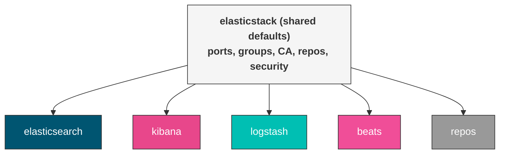

# elasticstack (shared defaults)

Shared defaults for the `oddly.elasticstack` collection. These variables are used across all roles (elasticsearch, kibana, logstash, beats, repos) to provide consistent configuration for inventory group names, ports, TLS certificate authority settings, and repository configuration.

You typically set these in `group_vars/all.yml` so they apply to every host in your inventory.



## Default Variables

### Inventory Group Names

These variables tell each role where to find the other services in your Ansible inventory. Override them if your group names differ from the defaults.

#### elasticstack_elasticsearch_group_name

Ansible inventory group containing Elasticsearch hosts.

```yaml
elasticstack_elasticsearch_group_name: elasticsearch  # default
```

#### elasticstack_logstash_group_name

Ansible inventory group containing Logstash hosts.

```yaml
elasticstack_logstash_group_name: logstash  # default
```

#### elasticstack_kibana_group_name

Ansible inventory group containing Kibana hosts.

```yaml
elasticstack_kibana_group_name: kibana  # default
```

### Network Ports

#### elasticstack_elasticsearch_http_port

Elasticsearch HTTP API port.

```yaml
elasticstack_elasticsearch_http_port: 9200  # default
```

#### elasticstack_kibana_port

Kibana web interface port.

```yaml
elasticstack_kibana_port: 5601  # default
```

#### elasticstack_beats_port

Port used for Beats-to-Logstash communication.

```yaml
elasticstack_beats_port: 5044  # default
```

### Certificate Authority

The collection runs its own PKI rooted in a CA generated by the Elasticsearch certutil tool. The CA lives on the first host in the `elasticsearch` group and all other roles fetch their certificates from it.

#### elasticstack_ca_host

Host that runs the certificate authority. Defaults to the first host in the `elasticsearch` inventory group.

```yaml
elasticstack_ca_host: "{{ (groups[elasticstack_elasticsearch_group_name] | default([inventory_hostname]))[0] }}"
```

#### elasticstack_ca_dir

Directory where the CA certificate and key are stored.

```yaml
elasticstack_ca_dir: /opt/es-ca  # default
```

#### elasticstack_ca_name

Subject name (CN) for the generated CA certificate.

```yaml
elasticstack_ca_name: "CN=Elastic Certificate Tool Autogenerated CA"  # default
```

#### elasticstack_ca_pass

Passphrase for the CA private key. **Change this in production.**

```yaml
elasticstack_ca_pass: PleaseChangeMe  # default
```

#### elasticstack_ca_validity_period

Validity period in days for the CA certificate. Default is 3 years.

```yaml
elasticstack_ca_validity_period: 1095  # default
```

#### elasticstack_ca_expiration_buffer

Days before CA certificate expiry to trigger renewal. Renewing the CA triggers renewal of all dependent certificates.

```yaml
elasticstack_ca_expiration_buffer: 30  # default
```

#### elasticstack_ca_will_expire_soon

Internal flag. Do not set manually.

```yaml
elasticstack_ca_will_expire_soon: false  # default
```

### General Settings

#### elasticstack_release

Major version of the Elastic Stack to install. Set to `8` or `9`. This controls which package repository is configured and which configuration format is used.

```yaml
elasticstack_release: 8  # default
```

#### elasticstack_full_stack

Whether this is a coordinated multi-service deployment. When `true`, roles auto-discover each other through inventory groups and share TLS certificates via the central CA. When `false`, each role operates standalone and uses explicit host lists (like `beats_target_hosts`).

```yaml
elasticstack_full_stack: true  # default
```

#### elasticstack_security

Enable security features across the entire stack: TLS, authentication, and RBAC. This is the global toggle — individual roles have their own security flags that default based on this.

```yaml
elasticstack_security: true  # default
```

#### elasticstack_enable_repos

Let the `repos` role manage Elastic APT/YUM repositories. Set to `false` if you manage repositories through another mechanism (e.g. Satellite, Pulp).

```yaml
elasticstack_enable_repos: true  # default
```

#### elasticstack_initial_passwords

Path to the file containing initial Elasticsearch passwords generated during security setup. Other roles read the `elastic` password from this file.

```yaml
elasticstack_initial_passwords: /usr/share/elasticsearch/initial_passwords  # default
```

#### elasticstack_override_beats_tls

Force Beats to use TLS certificates from the Elasticsearch CA instead of its own CA. Useful when you want all certificates to come from the same authority.

```yaml
elasticstack_override_beats_tls: false  # default
```

### Repository Configuration

#### elasticstack_repo_base_url

Base URL for Elastic package repositories. Override this to point at a local mirror, caching proxy, or air-gapped repository. Can also be set via the `ELASTICSTACK_REPO_BASE_URL` environment variable.

```yaml
# default: https://artifacts.elastic.co (or ELASTICSTACK_REPO_BASE_URL env var)
elasticstack_repo_base_url: "{{ lookup('env', 'ELASTICSTACK_REPO_BASE_URL') | default('https://artifacts.elastic.co', true) }}"
```

Example — local mirror:

```yaml
elasticstack_repo_base_url: "https://elastic-cache.internal.example.com"
```

#### elasticstack_repo_key

URL to the GPG key used to verify Elastic packages.

```yaml
elasticstack_repo_key: "{{ elasticstack_repo_base_url }}/GPG-KEY-elasticsearch"  # default
```

#### elasticstack_rpm_workaround

Apply workaround for RPM package installation issues on certain RHEL versions.

```yaml
elasticstack_rpm_workaround: false  # default
```

### Debugging

#### elasticstack_no_log

Suppress sensitive output (passwords, tokens) in Ansible logs. Set to `false` when debugging authentication or certificate issues.

```yaml
elasticstack_no_log: true  # default
```

## Operational notes

### Role import guard

The shared role sets a fact `_elasticstack_role_imported: true` after running. Every other role checks this fact before importing the shared role:

```yaml
when: not hostvars[inventory_hostname]._elasticstack_role_imported | default(false)
```

This prevents the shared role from executing multiple times per host when multiple roles are applied in sequence. In combined playbooks (e.g. elasticsearch + kibana + logstash in one play), the shared role runs once and all subsequent roles skip it.

### CA host selection

The CA host defaults to the first host in the `elasticsearch` inventory group. If that group doesn't exist (e.g. in a standalone Logstash deployment), it falls back to the first host in the `logstash` group, then to `inventory_hostname`. All certificate operations delegate to this host.

### Password file and fetch mechanism

The initial passwords file (`/usr/share/elasticsearch/initial_passwords`) is generated by `elasticsearch-setup-passwords auto -b` during the first Elasticsearch security setup. It contains lines in the format:

```
Changed password for user <username>
PASSWORD <username> = <password>
```

The `fetch_password.yml` shared task extracts a specific user's password with `grep "PASSWORD <user> " | awk '{print $4}'` and registers it as an Ansible fact. All password fetches delegate to the CA host and respect `elasticstack_no_log` to suppress output.

### Ansible version check

The shared role enforces a minimum Ansible version of 2.18.0. It fails with a clear error message if an older version is detected.

### OS-specific version separator

Package version pinning uses different separators per OS family:

- **Debian**: `=` (e.g. `elasticsearch=9.0.2`)
- **RedHat**: `-` (e.g. `elasticsearch-9.0.2`)

This is set via `elasticstack_versionseparator` in OS-specific vars files (`vars/Debian.yml`, `vars/RedHat.yml`).

### Certificate distribution throttle

Certificate distribution from the CA host uses `throttle: 1` to prevent parallel fetch conflicts when multiple nodes try to retrieve certificates simultaneously.

### Shared certificate tasks

The `certs/` directory contains reusable tasks imported by all roles:

| Task | Purpose |
|------|---------|
| `ca_ensure.yml` | Create CA directory and generate CA P12 if missing |
| `ca_extract_public.yml` | Extract `ca.crt` from CA P12 |
| `cert_generate.yml` | Generate a service certificate (P12 or PEM) with SANs |
| `cert_check_expiry.yml` | Check certificate expiry and set `*_will_expire_soon` fact |
| `cert_backup.yml` | Create timestamped backup of certificates before renewal |
| `cert_distribute.yml` | Fetch cert from CA host to controller, then copy to target node |
| `fetch_password.yml` | Extract a user's password from the initial passwords file |

## Tags

| Tag | Purpose |
|-----|---------|
| `certificates` | Run all certificate-related tasks |
| `renew_ca` | Renew the certificate authority |
| `renew_es_cert` | Renew Elasticsearch certificates |
| `renew_kibana_cert` | Renew Kibana certificates |
| `renew_logstash_cert` | Renew Logstash certificates |
| `renew_beats_cert` | Renew Beats certificates |

## License

GPL-3.0-or-later
