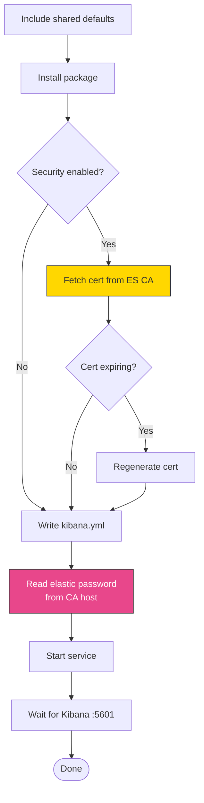

# kibana

Ansible role for installing, configuring, and managing Kibana. Handles service management, TLS encryption for the Kibana web UI, Elasticsearch connection setup, and certificate management.

In a full-stack deployment, this role runs after `elasticsearch`. It connects to Elasticsearch using the `elastic` user password generated during security setup, and optionally serves the Kibana web UI over HTTPS with its own TLS certificate.

## Task flow



## Requirements

- Minimum Ansible version: `2.18`
- The `elasticsearch` role must have completed (Kibana needs a running ES cluster to connect to)

## Default Variables

### Service Management

#### kibana_enable

Whether to enable and start the Kibana service.

```yaml
kibana_enable: true  # default
```

#### kibana_manage_yaml

Let the role manage `kibana.yml`. Set to `false` to manage the configuration file yourself.

```yaml
kibana_manage_yaml: true  # default
```

#### kibana_config_backup

Create a backup of `kibana.yml` before overwriting.

```yaml
kibana_config_backup: true  # default
```

### Security

#### kibana_security

Enable security features — connects to Elasticsearch over HTTPS with the `elastic` user credentials. When `elasticstack_security` is `true`, this is typically also `true`.

```yaml
kibana_security: true  # default
```

#### kibana_sniff_on_start

Discover all Elasticsearch nodes in the cluster on Kibana startup. Useful for multi-node ES clusters where Kibana should be aware of all nodes.

```yaml
kibana_sniff_on_start: false  # default
```

#### kibana_sniff_on_connection_fault

Re-discover Elasticsearch nodes when a connection fault is detected. Helps Kibana recover automatically when an ES node goes down.

```yaml
kibana_sniff_on_connection_fault: false  # default
```

### TLS for Kibana Web Interface

These settings control HTTPS on the Kibana frontend itself (what users access in their browser). This is separate from the TLS used to connect to Elasticsearch.

#### kibana_tls

Enable TLS on the Kibana web interface (serve Kibana over HTTPS). When `false`, Kibana serves over plain HTTP on port 5601. You typically terminate TLS at a reverse proxy instead.

```yaml
kibana_tls: false  # default
```

#### kibana_tls_cert

Path to the TLS certificate file for the Kibana web interface.

```yaml
kibana_tls_cert: /etc/kibana/certs/cert.pem  # default
```

#### kibana_tls_key

Path to the TLS private key file for the Kibana web interface.

```yaml
kibana_tls_key: /etc/kibana/certs/key.pem  # default
```

#### kibana_tls_key_passphrase

Passphrase for the Kibana TLS private key.

```yaml
kibana_tls_key_passphrase: PleaseChangeMe  # default
```

### Custom TLS Certificates

#### kibana_cert_source

Certificate source: `elasticsearch_ca` (auto-generated, default) or `external` (bring your own).

```yaml
kibana_cert_source: elasticsearch_ca  # default
```

#### kibana_tls_certificate_file

Path to the Kibana TLS certificate. Accepts PEM or P12 — format auto-detected.

```yaml
kibana_tls_certificate_file: ""  # default
```

#### kibana_tls_key_file

Path to the TLS private key. Auto-derived from cert path for PEM if left empty.

```yaml
kibana_tls_key_file: ""  # default
```

#### kibana_tls_certificate_passphrase

Passphrase for encrypted key or P12.

```yaml
kibana_tls_certificate_passphrase: ""  # default
```

#### kibana_tls_ca_file

Path to CA certificate. Auto-extracted from PEM chain if cert has multiple blocks.

```yaml
kibana_tls_ca_file: ""  # default
```

#### kibana_tls_remote_src

Whether cert files are on the managed node (`true`) or Ansible controller (`false`).

```yaml
kibana_tls_remote_src: false  # default
```

#### Inline PEM content variables

| Variable | Description |
|----------|-------------|
| `kibana_tls_certificate_content` | Certificate as inline PEM |
| `kibana_tls_key_content` | Key as inline PEM |
| `kibana_tls_ca_content` | CA cert as inline PEM |

### Certificate Lifecycle

#### kibana_cert_validity_period

Validity period in days for generated TLS certificates. Default is 3 years.

```yaml
kibana_cert_validity_period: 1095  # default
```

#### kibana_cert_expiration_buffer

Days before certificate expiry to trigger automatic renewal.

```yaml
kibana_cert_expiration_buffer: 30  # default
```

#### kibana_cert_will_expire_soon

Internal flag set when certificates are within the expiration buffer. Do not set manually.

```yaml
kibana_cert_will_expire_soon: false  # default
```

### Internal Variables

#### kibana_freshstart

Tracks whether this is a fresh installation. Do not set manually.

```yaml
kibana_freshstart:
  changed: false
```

## Operational notes

### Encryption keys

The role generates two persistent encryption keys on the CA host during security setup:

- **General encryption key** (`xpack.security.encryptionKey`) — used for session cookies and other security tokens
- **Saved objects encryption key** (`xpack.encryptedSavedObjects.encryptionKey`) — used for encrypting saved objects like alert rules and connector credentials

Both keys are 36-byte base64 values generated with `openssl rand` and stored in `{{ elasticstack_ca_dir }}/encryption_key` and `savedobjects_encryption_key`. They use a `creates:` guard so they're generated once and never overwritten — losing these keys would invalidate all encrypted saved objects.

### Elasticsearch host resolution

The role resolves ES hosts through a multi-level fallback:

1. If `kibana_elasticsearch_hosts` is explicitly set, use it
2. Otherwise, if the `elasticstack_elasticsearch_group_name` group exists in inventory, build the host list from that group
3. If neither is available, fall back to `localhost`

### Localhost TLS verification

When Kibana connects to Elasticsearch on `localhost`, hostname verification would fail because the ES certificate contains the node's real hostname, not `localhost`. The template detects this and sets `elasticsearch.ssl.verificationMode: certificate` (verify the certificate chain only, skip hostname check). For non-localhost connections, full verification is used.

### Server binding

Kibana binds to `0.0.0.0` (all interfaces) by default. This is hardcoded in the template, not configurable via a variable. If you need to restrict binding, use `kibana_extra_config`:

```yaml
kibana_extra_config: |
  server.host: "127.0.0.1"
```

### Password inheritance

If `elasticstack_cert_pass` is defined (a global cert passphrase), the role uses it as `kibana_tls_key_passphrase` instead of the role's own default. This lets you set a single passphrase for all roles.

### Readiness wait

The role waits for Kibana port 5601 with an explicit 300-second timeout. Kibana can take several minutes to start on first run (especially on low-memory hosts) as it creates system indices and generates browser bundles. Without the explicit timeout, Ansible's `wait_for` module could hang indefinitely in some environments.

### Handler guard

The "Restart Kibana" handler does not fire on fresh installs (`kibana_freshstart.changed` guard). On a first run, the service starts naturally during the "Start Kibana" task — a handler restart would be redundant and could cause a brief outage during initial index creation.

### Three-tier certificate backup

During certificate renewal, the role backs up the existing certificate to three locations before replacing it:

1. On the Kibana node itself (`/etc/kibana/certs/`)
2. On the CA host (the P12 file used to generate the cert)
3. On the Ansible controller (fetched copy)

This provides recovery options if renewal causes issues.

### Container cache cleanup

In container environments, the role runs `rm -rf /var/cache/*` after starting Kibana. This frees disk space so Elasticsearch can allocate replicas of the `.security-7` index (which requires >85% free disk by default, or >97% with the role's lenient watermarks).

## Tags

| Tag | Purpose |
|-----|---------|
| `certificates` | Run all certificate-related tasks |
| `renew_ca` | Renew the certificate authority |
| `renew_kibana_cert` | Renew only the Kibana certificate |

## License

GPL-3.0-or-later

## Author

Netways GmbH
