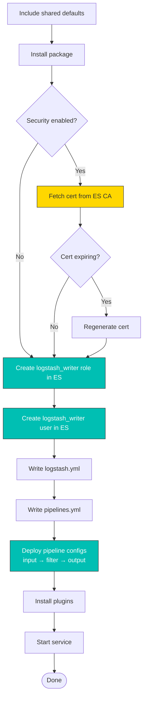

# logstash

Ansible role for installing, configuring, and managing Logstash. Handles pipeline configuration (inputs, filters, outputs), TLS certificate management, Elasticsearch user/role creation for the `logstash_writer` account, queue management, and plugin installation.

In a full-stack deployment, this role runs after `elasticsearch`. It creates a dedicated `logstash_writer` user and role in Elasticsearch with the minimum privileges needed to write indices, then configures a pipeline that receives events from Beats on port 5044 and writes them to Elasticsearch. The role supports three certificate sources: fetching from the Elasticsearch CA (default), generating standalone certificates, or using externally-provided certificates.

## Task flow



## Requirements

- Minimum Ansible version: `2.18`
- The `elasticsearch` role must have completed (Logstash needs ES for user/role creation and output)

## Default Variables

### Service Management

#### logstash_enable

Whether to enable and start the Logstash service.

```yaml
logstash_enable: true  # default
```

#### logstash_manage_yaml

Let the role manage `logstash.yml`. Set to `false` to manage the configuration file yourself.

```yaml
logstash_manage_yaml: true  # default
```

#### logstash_config_backup

Create a backup of `logstash.yml` before overwriting.

```yaml
logstash_config_backup: false  # default
```

#### logstash_config_autoreload

Automatically reload pipeline configuration when files change on disk. Useful during development; safe to leave enabled in production.

```yaml
logstash_config_autoreload: true  # default
```

### Paths

#### logstash_config_path_data

Filesystem path for Logstash persistent data (queue files, dead letter queue, sincedb).

```yaml
logstash_config_path_data: /var/lib/logstash  # default
```

#### logstash_config_path_logs

Filesystem path for Logstash log files.

```yaml
logstash_config_path_logs: /var/log/logstash  # default
```

### Pipeline Management

#### logstash_manage_pipelines

Let the role manage `pipelines.yml` and the pipeline config files (`/etc/logstash/conf.d/`). Set to `false` if you deploy pipeline configs through another mechanism.

```yaml
logstash_manage_pipelines: true  # default
```

#### logstash_no_pipelines

Remove all pipeline configuration files. Useful when Logstash pipelines are managed by Kibana's Central Pipeline Management or another external tool.

```yaml
logstash_no_pipelines: false  # default
```

#### logstash_queue_type

Queue type for pipeline buffering. Use `persisted` for disk-backed queues that survive Logstash restarts (recommended for production), or `memory` for in-memory queues that are faster but lose data on restart.

```yaml
logstash_queue_type: persisted  # default
```

#### logstash_queue_max_bytes

Maximum size of the persisted queue before Logstash applies backpressure to inputs.

```yaml
logstash_queue_max_bytes: 1gb  # default
```

#### logstash_custom_pipeline

Complete pipeline config that replaces all `logstash_input_*`, `logstash_filters`, and `logstash_output_*` settings. When set, the role writes this as the sole pipeline configuration.

```yaml
logstash_custom_pipeline: ''  # default
```

Example — full custom pipeline:

```yaml
logstash_custom_pipeline: |
  input { stdin {} }
  filter { mutate { add_field => { "env" => "test" } } }
  output { stdout { codec => rubydebug } }
```

### Input Configuration

#### logstash_input_beats

Enable the Beats input plugin, which receives events from Filebeat, Metricbeat, and other Beats on port 5044.

```yaml
logstash_input_beats: true  # default
```

#### logstash_input_beats_port

Port for the Beats input listener.

```yaml
logstash_input_beats_port: 5044  # default
```

#### logstash_input_beats_ssl

Enable TLS on the Beats input. Inherits from `logstash_beats_tls` for backwards compatibility with older inventory files.

```yaml
logstash_input_beats_ssl: "{{ logstash_beats_tls | default(omit) }}"  # default
```

#### logstash_input_elastic_agent

Enable the Elastic Agent input plugin.

```yaml
logstash_input_elastic_agent: false  # default
```

#### logstash_input_elastic_agent_port

Port for the Elastic Agent input listener.

```yaml
logstash_input_elastic_agent_port: 5044  # default
```

#### logstash_input_elastic_agent_ssl

Enable TLS on the Elastic Agent input.

```yaml
logstash_input_elastic_agent_ssl: true  # default
```

#### logstash_extra_inputs

Raw Logstash input config appended to the input section. Use this for input plugins not directly supported by the role (HTTP, Kafka, S3, etc.).

```yaml
logstash_extra_inputs: ''  # default
```

Example:

```yaml
logstash_extra_inputs: |
  http {
    port => 8080
  }
```

### Filter Configuration

#### logstash_filters

Raw Logstash filter config inserted into the filter section. For simple pipelines where you want inline filters without separate files.

```yaml
logstash_filters: ''  # default
```

Example:

```yaml
logstash_filters: |
  grok {
    match => { "message" => "%{SYSLOGLINE}" }
  }
```

#### logstash_filter_files

List of filter config files to copy to the Logstash pipeline directory. Paths are relative to your playbook directory. Use this when your filters are too complex for inline config.

```yaml
logstash_filter_files: []  # default
```

Example:

```yaml
logstash_filter_files:
  - files/logstash/syslog-filter.conf
  - files/logstash/nginx-filter.conf
```

### Output Configuration

#### logstash_output_elasticsearch

Enable the Elasticsearch output plugin.

```yaml
logstash_output_elasticsearch: true  # default
```

#### logstash_elasticsearch_hosts

List of Elasticsearch hosts. Leave empty to auto-discover from the inventory group (when `elasticstack_full_stack: true`).

```yaml
logstash_elasticsearch_hosts: []  # default
```

#### logstash_elasticsearch_index

Elasticsearch index name pattern. Leave empty for the default `logstash-%{+YYYY.MM.dd}`.

```yaml
logstash_elasticsearch_index: ''  # default
```

#### logstash_validate_after_inactivity

Seconds of inactivity before re-validating an Elasticsearch connection.

```yaml
logstash_validate_after_inactivity: 300  # default
```

#### logstash_sniffing

Enable Elasticsearch node sniffing to discover all cluster members. Logstash will periodically query ES for the full node list and distribute writes across them.

```yaml
logstash_sniffing: false  # default
```

#### logstash_extra_outputs

Raw Logstash output config appended to the output section. Use for additional output plugins (file, Kafka, S3, etc.).

```yaml
logstash_extra_outputs: ''  # default
```

Example:

```yaml
logstash_extra_outputs: |
  file {
    path => "/var/log/logstash/debug.log"
  }
```

### Event Enrichment

#### logstash_ident

Add a `mutate` filter that stamps each event with the Logstash instance hostname. Helps identify which Logstash node processed an event in multi-node setups.

```yaml
logstash_ident: true  # default
```

#### logstash_ident_field_name

Field name for the Logstash instance identifier.

```yaml
logstash_ident_field_name: "[logstash][instance]"  # default
```

#### logstash_pipeline_identifier

Add a `mutate` filter that stamps each event with the pipeline name.

```yaml
logstash_pipeline_identifier: true  # default
```

#### logstash_pipeline_identifier_field_name

Field name for the pipeline identifier.

```yaml
logstash_pipeline_identifier_field_name: "[logstash][pipeline]"  # default
```

### Elasticsearch User and Role

The role creates a dedicated Elasticsearch user and role for Logstash to use when writing indices. This follows the principle of least privilege — Logstash authenticates with a user that has only the permissions it needs.

#### logstash_create_role

Create the Elasticsearch role for Logstash index writing.

```yaml
logstash_create_role: true  # default
```

#### logstash_role_name

Name of the Elasticsearch role.

```yaml
logstash_role_name: logstash_writer  # default
```

#### logstash_role_cluster_privileges

Cluster-level privileges granted to the role.

```yaml
logstash_role_cluster_privileges:  # default
  - manage_index_templates
  - monitor
  - manage_ilm
```

#### logstash_role_indicies_names

Index patterns the role is allowed to write to.

```yaml
logstash_role_indicies_names:  # default
  - "ecs-logstash*"
  - "logstash*"
  - "logs*"
```

#### logstash_role_indicies_privileges

Index-level privileges granted to the role.

```yaml
logstash_role_indicies_privileges:  # default
  - write
  - create
  - delete
  - create_index
  - manage
  - manage_ilm
```

#### logstash_create_user

Create the Elasticsearch user for Logstash.

```yaml
logstash_create_user: true  # default
```

#### logstash_user_name

Username for the Logstash Elasticsearch user.

```yaml
logstash_user_name: logstash_writer  # default
```

#### logstash_user_password

Password for the Logstash Elasticsearch user. **Change this in production.**

```yaml
logstash_user_password: password  # default
```

#### logstash_user_email

Email address for the Logstash user (optional metadata).

```yaml
logstash_user_email: ''  # default
```

#### logstash_user_fullname

Display name for the Logstash user.

```yaml
logstash_user_fullname: "Internal Logstash User"  # default
```

### Certificate Configuration

#### logstash_cert_source

Where to get TLS certificates:
- `elasticsearch_ca` — fetch from the Elasticsearch CA (default, used in full-stack deployments)
- `standalone` — generate a self-signed certificate
- `external` — use certificate files you provide via `logstash_tls_certificate_file`, `logstash_tls_key_file`, `logstash_tls_ca_file`

```yaml
logstash_cert_source: elasticsearch_ca  # default
```

#### logstash_certs_dir

Directory on the Logstash host where TLS certificates are stored.

```yaml
logstash_certs_dir: /etc/logstash/certs  # default
```

#### logstash_tls_key_passphrase

Passphrase for the Logstash TLS private key.

```yaml
logstash_tls_key_passphrase: LogstashChangeMe  # default
```

#### logstash_cert_validity_period

Validity period in days for generated TLS certificates. Default is 3 years.

```yaml
logstash_cert_validity_period: 1095  # default
```

#### logstash_cert_expiration_buffer

Days before certificate expiry to trigger renewal.

```yaml
logstash_cert_expiration_buffer: 30  # default
```

#### logstash_cert_force_regenerate

Force TLS certificate regeneration even if current certificates are still valid.

```yaml
logstash_cert_force_regenerate: false  # default
```

#### logstash_cert_will_expire_soon

Internal flag. Do not set manually.

```yaml
logstash_cert_will_expire_soon: false  # default
```

### Logging

#### logstash_manage_logging

Let the role manage `log4j2.properties`. Only needed if you want to customize Logstash's own logging behavior.

```yaml
logstash_manage_logging: false  # default
```

#### logstash_logging_console / logstash_logging_file

Enable console (stdout) and file-based logging.

```yaml
logstash_logging_console: true   # default
logstash_logging_file: true      # default
```

#### logstash_logging_slow_console / logstash_logging_slow_file

Enable slow log output to console and file. Slow logs record events that take longer than a threshold to process.

```yaml
logstash_logging_slow_console: true  # default
logstash_logging_slow_file: true     # default
```

### Plugins

#### logstash_plugins

List of Logstash plugins to install. The role runs `logstash-plugin install` for each.

```yaml
logstash_plugins: []  # default
```

Example:

```yaml
logstash_plugins:
  - logstash-filter-translate
  - logstash-input-s3
```

### Internal Variables

#### logstash_freshstart

Tracks whether this is a fresh installation. Do not set manually.

```yaml
logstash_freshstart:
  changed: false
```

## Operational notes

### Logstash 9.x refuses to run as root

Logstash 9.x will not execute as the root user at the CLI level. The systemd service runs as the `logstash` user and is not affected, but any custom scripts, cron jobs, or Ansible tasks that run Logstash commands as root will fail. The role detects when upgrading from 8.x to 9.x and warns about this. Set `logstash_skip_root_check: true` to bypass the warning if you've already accounted for it.

If you need to run Logstash CLI commands (e.g. `logstash --config.test_and_exit`) in Ansible, use:

```yaml
become_method: ansible.builtin.su
become_user: logstash
become_flags: '-s /bin/sh'
```

### Queue settings are in pipelines.yml, not logstash.yml

`logstash_queue_type` and `logstash_queue_max_bytes` are rendered into `pipelines.yml`, not `logstash.yml`. This is because Logstash supports multiple pipelines, each with its own queue configuration. The role's default `pipelines.yml` defines a single `main` pipeline:

```yaml
- pipeline.id: main
  path.config: "/etc/logstash/conf.d/main/*.conf"
  queue.type: persisted
  queue.max_bytes: 1gb
```

### Pipeline file numbering

The standard pipeline uses three config files in `/etc/logstash/conf.d/main/`:

- `10-input.conf` — input plugins (Beats, Elastic Agent, extras)
- `50-filter.conf` — filter plugins (grok, mutate, custom filters)
- `90-output.conf` — output plugins (Elasticsearch, extras)

Logstash loads `.conf` files alphabetically, so the numbering ensures correct execution order. When you set `logstash_custom_pipeline`, the role writes a single `pipeline.conf` and removes the three numbered files. Switching back from custom to standard mode removes `pipeline.conf`.

### PKCS8 key requirement

Logstash input plugins (Beats, Elastic Agent) require an unencrypted PKCS8 key, while the Elasticsearch output plugin uses a P12 keystore. The role generates both formats from the same certificate:

- **P12 cert** → copied as `keystore.pfx` for the ES output plugin
- **PEM cert** → extracted from a ZIP, with the encrypted key converted to unencrypted PKCS8 via `openssl pkcs8 -topk8 -nocrypt`

### ES 9.x vs 8.x SSL syntax

The Logstash input and output configuration templates use different SSL parameter names depending on the Elastic version:

| Setting | ES 8.x | ES 9.x |
|---------|--------|--------|
| Enable SSL | `ssl => true` | `ssl_enabled => true` |
| Certificate | `ssl_certificate` | `ssl_certificate` |
| Key | `ssl_key` | `ssl_key` |
| Client auth (input) | `ssl_verify_mode => force_peer` | `ssl_client_authentication => required` |
| Keystore (output) | `keystore` | `ssl_keystore_path` |
| Keystore pass (output) | `keystore_password` | `ssl_keystore_password` |
| CA cert (output) | `cacert` | `ssl_certificate_authorities` |

The template switches based on `elasticstack_release | int >= 9`.

### Event enrichment (ident stamping)

When `logstash_ident` is enabled (default `true`), the role adds a `mutate` filter that sets `[logstash][instance]` to the hostname. When `logstash_pipeline_identifier` is enabled (default `true`), it sets `[logstash][pipeline]` to `"main"`. These fields help trace which Logstash node and pipeline processed an event.

The ident block appears in both the filter config (`50-filter.conf`) and the output config (`90-output.conf`). The filter block uses `inventory_hostname` while the output block uses `ansible_facts.hostname`.

### Certificate modes

The `logstash_cert_source` variable controls where TLS certificates come from:

- **`elasticsearch_ca`** (default) — fetches certificates from the Elasticsearch CA host. The role also creates the `logstash_writer` user and role in Elasticsearch.
- **`standalone`** — for environments where Logstash runs independently. User/role creation still occurs.
- **`external`** — uses certificate files you provide via `logstash_tls_certificate_file`, `logstash_tls_key_file`, and optionally `logstash_tls_ca_file`. The role copies them into place but does NOT create the ES user/role (assumes you manage that separately).

### Password validation

The role validates that `logstash_user_password` is at least 6 characters. Elasticsearch rejects shorter passwords, so the role fails early with a clear error rather than letting the API call fail cryptically.

### Backwards compatibility

The role supports three deprecated variable names that map to current ones:

| Old name | New name |
|----------|----------|
| `logstash_beats_tls` | `logstash_input_beats_ssl` |
| `logstash_beats_input` | `logstash_input_beats` |
| `logstash_elasticsearch_output` | `logstash_output_elasticsearch` |

### Handler behavior

Two restart handlers exist:

- **"Restart Logstash"** — fires on config/cert changes, but NOT on fresh install (`logstash_freshstart.changed` guard)
- **"Restart Logstash noauto"** — only fires when `logstash_config_autoreload` is disabled. Pipeline changes notify this handler, but if autoreload is enabled, Logstash picks up changes on its own and the handler is skipped.

### Elasticsearch host discovery

Like other roles, Logstash resolves ES hosts through a fallback chain:

1. Explicit `logstash_elasticsearch_hosts` list
2. Inventory group `elasticstack_elasticsearch_group_name` (in full-stack mode)
3. Fall back to `localhost`

## Tags

| Tag | Purpose |
|-----|---------|
| `certificates` | Run all certificate-related tasks |
| `configuration` | Run configuration tasks only |
| `logstash_configuration` | Logstash-specific configuration |
| `preflight` | Pre-flight checks only |
| `renew_ca` | Renew the certificate authority |
| `renew_logstash_cert` | Renew only the Logstash certificate |
| `upgrade` | Run upgrade-related tasks |

## License

GPL-3.0-or-later

## Author

Netways GmbH
