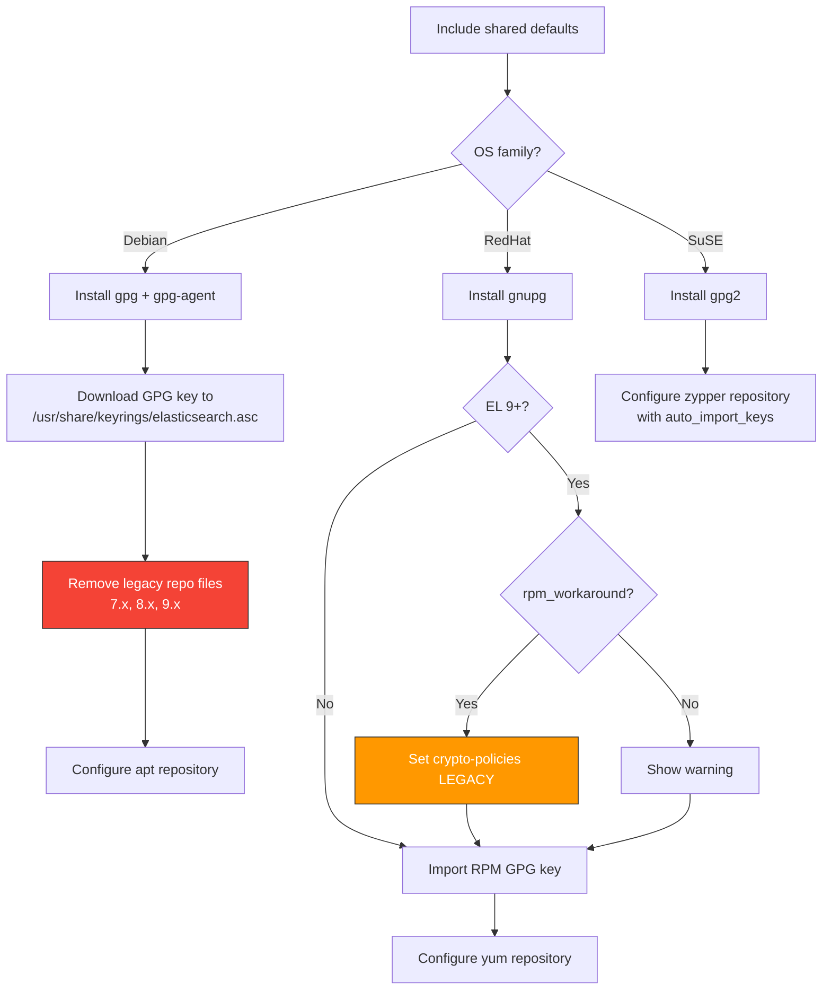

# repos

Ansible role for configuring Elastic Stack package repositories. Sets up APT, YUM, or Zypper repositories and imports the Elastic GPG signing key. This role must run before any other role in the collection so that packages are available for installation.

The role has no service to manage — it only configures the package manager. It delegates to the shared `elasticstack` role for defaults (base URL, release version, GPG key URL).

## Task flow



## Requirements

- Minimum Ansible version: `2.18`

## What it does per OS family

### Debian / Ubuntu

1. Installs `gpg` and `gpg-agent` packages
2. Downloads the Elastic GPG key to `/usr/share/keyrings/elasticsearch.asc`
3. Removes legacy repository files from previous major versions (cleans up `/etc/apt/sources.list.d/artifacts_elastic_co_packages_{7,8,9}_x_apt.list`)
4. Configures the APT repository with signed-by pointing at the downloaded keyring:
   ```
   deb [signed-by=/usr/share/keyrings/elasticsearch.asc] <base_url>/packages/<release>.x/apt stable main
   ```

### RedHat / Rocky Linux / RHEL

1. Installs `gnupg`
2. On EL 9+, applies a crypto-policy workaround (see below)
3. Imports the Elastic RPM GPG key via `rpm_key`
4. Configures the YUM repository at `<base_url>/packages/<release>.x/yum`

### SuSE

1. Installs `gpg2`
2. Configures the Zypper repository with `auto_import_keys: true`

## EL 9+ crypto-policy workaround

RHEL 9 and derivatives ship with stricter default crypto policies that can prevent RPM signature verification of older Elastic packages (see [elasticsearch#85876](https://github.com/elastic/elasticsearch/issues/85876)). The workaround sets `update-crypto-policies --set LEGACY` to relax the policy.

This workaround is gated behind `elasticstack_rpm_workaround`. If you're on EL 9+ and don't enable it, the role prints a debug warning but continues. Set it to `true` if RPM key import fails:

```yaml
elasticstack_rpm_workaround: true
```

## Legacy repository cleanup

On Debian, the role removes old-format repository files for versions 7, 8, and 9. This prevents `apt update` conflicts when switching between major versions or when the repository file naming convention has changed from earlier versions of this collection.

## Default Variables

All repository configuration comes from the shared `elasticstack` role defaults. The repos role has no defaults of its own. The relevant shared variables are:

| Variable | Default | Purpose |
|----------|---------|---------|
| `elasticstack_release` | `8` | Major version — controls which repo URL is configured |
| `elasticstack_repo_base_url` | `https://artifacts.elastic.co` | Base URL for repos (override for mirrors). Also reads `ELASTICSTACK_REPO_BASE_URL` env var |
| `elasticstack_repo_key` | `<base_url>/GPG-KEY-elasticsearch` | GPG key URL |
| `elasticstack_enable_repos` | `true` | Whether the YUM/Zypper repo is `enabled` (APT repos are always present once added) |
| `elasticstack_rpm_workaround` | `false` | Apply EL 9+ crypto-policy workaround |

See [Roles-elasticstack](Roles-elasticstack) for full documentation of these variables.

## Tags

This role does not define any tags.

## License

GPL-3.0-or-later

## Author

Netways GmbH
